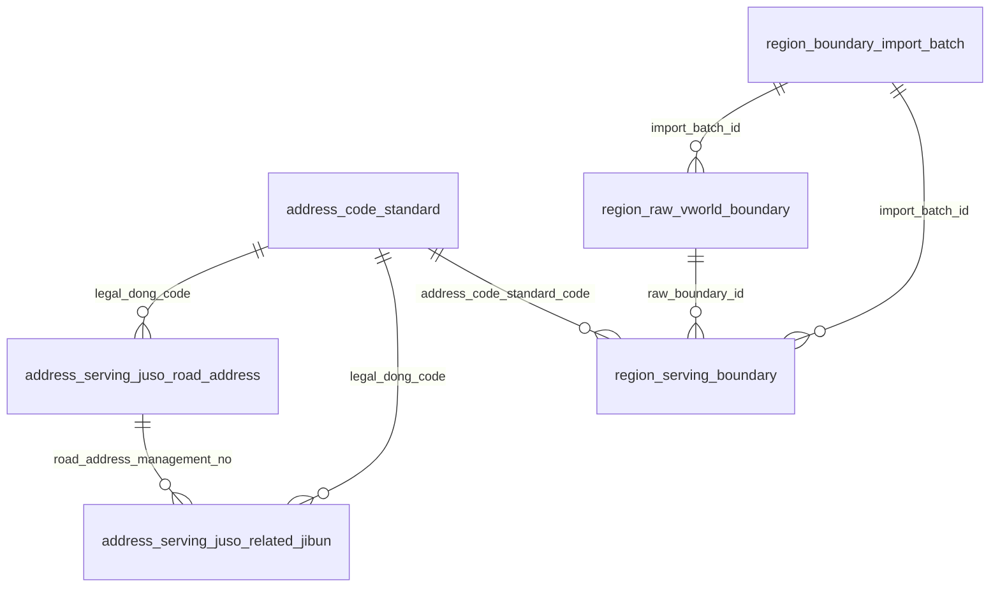

# 주소 DB 스키마

이 문서는 TripMate의 현재 주소 관련 PostgreSQL/PostGIS 스키마를 설명한다.

기준 자료:

- SQLAlchemy 모델: `apps/api/app/models/address.py`
- Alembic migration: `20260424_0002`부터 `20260425_0006`까지
- 데이터 정책: `docs/data-sources.md`

## 설계 목표

- 주소와 코드 key는 모두 문자열로 저장한다. 선행 0이 의미를 가지므로 숫자로 변환하지 않는다.
- 원천 row는 재처리, 감사, 변경 비교를 위해 raw 테이블에 보존한다.
- 앱 조회에는 정규화된 serving 테이블을 사용한다.
- `address_code_standard.legal_dong_code`를 법정동 기반 주소 데이터의 안정적인 FK 기준으로 사용한다.
- `address_code_standard`는 정기 갱신 중 물리 삭제하지 않는다. 사라진 코드나 폐지 코드는 비활성 상태로 표시한다.
- 주소나 행정구역 코드가 나중에 사라져도 기존 여행 장소와 주소 snapshot이 계속 조회될 수 있어야 한다.

## 테이블 그룹

주소 관련 테이블은 네 그룹으로 나뉜다.

| 그룹 | 테이블 | 목적 |
| --- | --- | --- |
| 법정동코드 기준 | `address_code_standard`, `address_raw_legal_dong_code` | 행정구역 코드 기준 테이블과 원천 코드 row |
| Juso 도로명주소 | `address_raw_juso_road_address`, `address_serving_juso_road_address` | 도로명주소 원천 row와 앱 조회용 정규화 row |
| Juso 관련 지번 | `address_raw_juso_related_jibun`, `address_serving_juso_related_jibun` | 관련 지번 원천 row와 앱 조회용 정규화 row |
| VWorld 경계 | `region_boundary_import_batch`, `region_raw_vworld_boundary`, `region_serving_boundary` | SHP 적재 이력, 원본 geometry, EPSG:4326 serving 경계 |

## 법정동코드 기준 테이블

### `address_code_standard`

주소 코드의 canonical 기준 테이블이다. PK 이름은 `legal_dong_code`이지만, 실제로는 원천 파일의 10자리 행정구역 코드 전 단계를 담는다.

- `sido`
- `sigungu`
- `legal_dong`

PK:

- `legal_dong_code varchar(10)`

index:

- `code_level`
- `sido_code`
- `sigungu_code`
- `previous_legal_dong_code`

주요 컬럼:

| 컬럼 | 타입 | 필수 | 의미 |
| --- | --- | --- | --- |
| `legal_dong_code` | string(10) | 예 | 안정적인 PK 및 FK target |
| `code_level` | string(32) | 예 | `sido`, `sigungu`, `legal_dong` |
| `code_name` | string(255) | 예 | 해당 코드 row의 원천 표시명 |
| `sido_code` | string(10) | 예 | 10자리 시도 코드 |
| `sigungu_code` | string(10) | 예 | 10자리 시군구 코드 |
| `sido_name` | string(40) | 아니오 | 시도명 |
| `sigungu_name` | string(80) | 아니오 | 시군구명. 세종 시도 row처럼 없을 수 있다 |
| `legal_eupmyeondong_name` | string(80) | 아니오 | 법정 읍면동명 |
| `legal_ri_name` | string(80) | 아니오 | 법정 리명 |
| `full_legal_dong_name` | string(255) | 예 | 전체 법정동명 |
| `source_effective_date` | string(8) | 예 | 원천 기준일 또는 적용일 |
| `source_change_reason_code` | string(2) | 예 | Juso 이동사유 코드 또는 기본값 `00` |
| `source_provider` | string(32) | 예 | `data_go_legal_dong`, legacy `vworld_lawd_cd`, bootstrap `juso_road_address` |
| `source_status` | string(40) | 예 | `active`, `deleted`, `missing_from_latest_download`, legacy 상태값 |
| `source_file_name` | string(255) | 예 | 원천 파일명 |
| `source_year_month` | string(6) | 예 | 원천 연월 |
| `source_file_hash` | string(64) | 예 | 원천 파일 SHA-256 |
| `source_sort_order` | integer | 아니오 | 원천 `순위` |
| `source_created_date` | string(10) | 아니오 | 원천 `생성일자` |
| `source_deleted_date` | string(10) | 아니오 | 원천 `삭제일자` |
| `previous_legal_dong_code` | string(10) | 아니오 | 원천 `과거법정동코드` |
| `is_discontinued` | boolean | 예 | 폐지/삭제 여부 |
| `is_active` | boolean | 예 | 신규 검색과 serving 기준 활성 여부 |
| `created_at`, `updated_at` | timestamp | 예 | ORM timestamp mixin |

현재 canonical source:

- data.go.kr `국토교통부_전국 법정동`
- `dags/legal_dong_code_standard.py`에서 다운로드한다.
- `app.etl.vworld.legal_dong_code_loader`가 적재한다.

갱신 정책:

- 기존 row는 upsert한다.
- 새 다운로드에서 사라진 코드는 유지하고 다음처럼 표시한다.
  - `is_active = false`
  - `is_discontinued = true`
  - `source_status = 'missing_from_latest_download'`
- 원천 `삭제일자`가 있는 코드는 유지하고 다음처럼 표시한다.
  - `is_active = false`
  - `is_discontinued = true`
  - `source_status = 'deleted'`
- 정기 갱신에서 물리 삭제하지 않는다. Juso 주소, 경계, 향후 장소, 지오코딩 snapshot이 과거 코드를 참조할 수 있기 때문이다.

### `address_raw_legal_dong_code`

법정동코드 원천 row를 저장하는 raw 테이블이다.

PK:

- `id uuid`

unique:

- `unique(source_file_hash, row_number)`

index:

- `source_file_hash`
- `legal_dong_code`

목적:

- 원천 row lineage를 보존한다.
- 파일 hash와 row number 기준으로 멱등 재적재를 지원한다.
- data.go.kr의 추가 필드를 감사와 재처리에 사용할 수 있게 보존한다.

주요 컬럼:

| 컬럼 | 의미 |
| --- | --- |
| `source_file_name`, `source_file_hash` | 원천 파일 식별 |
| `row_number` | CSV 내부 1-based row 번호 |
| `legal_dong_code` | 원천 법정동코드 |
| `legal_dong_name` | 원천 기반 전체 법정동명 |
| `discontinued_status` | `active`/`deleted` 또는 legacy 원천 상태 |
| `sido_name`, `sigungu_name`, `legal_eupmyeondong_name`, `legal_ri_name` | 원천 명칭 필드 |
| `source_sort_order`, `source_created_date`, `source_deleted_date`, `previous_legal_dong_code` | data.go.kr 추가 필드 |
| `raw_line` | 감사용 CSV 원문 line |
| `ingested_at` | 적재 시각 |

## Juso 도로명주소 테이블

### `address_raw_juso_road_address`

Juso 도로명주소 TXT의 원천 row를 저장한다.

PK:

- `id uuid`

unique:

- `unique(source_file_hash, row_number)`

index:

- `source_year_month`
- `source_file_hash`
- `legal_dong_code`

주요 컬럼:

| 컬럼 | 의미 |
| --- | --- |
| `source_file_name`, `source_year_month`, `source_file_hash` | 원천 snapshot 식별 |
| `row_number` | 원천 row 번호 |
| `delimiter` | 파싱 delimiter |
| `road_address_management_no` | 도로명주소관리번호 |
| `legal_dong_code` | Juso 법정동코드 |
| `road_name_code` | 도로명코드 |
| `administrative_dong_code` | 행정동코드. nullable |
| `effective_date` | 적용일자 |
| `change_reason_code` | 이동사유 코드 |
| `raw_line` | 원본 TXT line |
| `ingested_at` | 적재 시각 |

이 테이블은 raw 전용이다. 앱 조회는 `address_serving_juso_road_address`를 사용한다.

### `address_serving_juso_road_address`

앱 조회용 정규화 도로명주소 테이블이다.

PK:

- `road_address_management_no`

FK:

- `legal_dong_code -> address_code_standard.legal_dong_code`

index:

- `legal_dong_code`
- `road_name_code`
- `administrative_dong_code`

주요 컬럼:

| 컬럼 | 의미 |
| --- | --- |
| `road_address_management_no` | 도로명주소의 주요 식별자 |
| `legal_dong_code` | canonical code table FK |
| `road_name_code` | 도로명코드 |
| `administrative_dong_code` | 행정동코드. nullable |
| `sido_name`, `sigungu_name`, `legal_eupmyeondong_name`, `legal_ri_name` | 주소 명칭 구성 요소 |
| `road_name` | 도로명 |
| `administrative_dong_name` | 행정동명 |
| `mountain_yn`, `jibun_main_no`, `jibun_sub_no` | 대표 지번 구성 요소 |
| `underground_yn`, `building_main_no`, `building_sub_no` | 건물번호 구성 요소 |
| `postal_code` | 우편번호 |
| `previous_road_address` | 이전 도로명주소 |
| `apartment_yn` | 공동주택 여부 |
| `building_registry_name`, `sigungu_building_name` | 건물명 |
| `note` | 원천 비고 |
| `full_legal_dong_name` | 전체 법정동 주소명 |
| `full_road_address` | 전체 도로명주소 |
| `source_effective_date`, `source_change_reason_code` | 원천 메타데이터 |
| `source_file_name`, `source_year_month`, `source_file_hash` | 원천 lineage |
| `is_active` | serving 표시 여부 |
| `created_at`, `updated_at` | ORM timestamp mixin |

도로명주소 기반 geocoding 결과를 TripMate의 안정적인 주소 key에 연결할 때 우선 사용한다.

## Juso 관련 지번 테이블

### `address_raw_juso_related_jibun`

Juso 관련 지번 TXT의 원천 row를 저장한다.

PK:

- `id uuid`

unique:

- `unique(source_file_hash, row_number)`

index:

- `source_year_month`
- `source_file_hash`
- `legal_dong_code`

주요 컬럼:

| 컬럼 | 의미 |
| --- | --- |
| `source_file_name`, `source_year_month`, `source_file_hash` | 원천 snapshot 식별 |
| `row_number` | 원천 row 번호 |
| `road_address_management_no` | 도로명주소 연결 key |
| `legal_dong_code` | 법정동코드 |
| `sido_name`, `sigungu_name`, `legal_eupmyeondong_name`, `legal_ri_name` | 주소 명칭 구성 요소 |
| `mountain_yn`, `jibun_main_no`, `jibun_sub_no` | 지번 구성 요소 |
| `road_name_code` | 도로명코드 |
| `underground_yn`, `building_main_no`, `building_sub_no` | 건물번호 구성 요소 |
| `note` | 원천 비고 |
| `raw_line` | 원본 TXT line |
| `ingested_at` | 적재 시각 |

### `address_serving_juso_related_jibun`

앱 조회용 정규화 관련 지번 테이블이다.

PK:

- `id uuid`

FK:

- `road_address_management_no -> address_serving_juso_road_address.road_address_management_no`
  - `ondelete='CASCADE'`
- `legal_dong_code -> address_code_standard.legal_dong_code`

unique:

- `unique(road_address_management_no, legal_dong_code, mountain_yn, jibun_main_no, jibun_sub_no)`

index:

- `road_address_management_no`
- `legal_dong_code`
- `road_name_code`

주요 컬럼:

| 컬럼 | 의미 |
| --- | --- |
| `road_address_management_no` | 연결된 도로명주소 row |
| `legal_dong_code` | canonical code table FK |
| `road_name_code` | 도로명코드 |
| `sido_name`, `sigungu_name`, `legal_eupmyeondong_name`, `legal_ri_name` | 주소 명칭 구성 요소 |
| `mountain_yn`, `jibun_main_no`, `jibun_sub_no` | 관련 지번 key |
| `underground_yn`, `building_main_no`, `building_sub_no` | 건물번호 구성 요소 |
| `note` | 원천 비고 |
| `full_legal_dong_name` | 전체 법정동 주소명 |
| `full_jibun_address` | 전체 지번주소 |
| `source_file_name`, `source_year_month`, `source_file_hash` | 원천 lineage |
| `is_active` | serving 표시 여부 |
| `created_at`, `updated_at` | ORM timestamp mixin |

입력 주소나 reverse geocoding 결과가 지번주소로 해석될 때 사용한다.

## VWorld 경계 테이블

### `region_boundary_import_batch`

VWorld SHP ZIP 업로드 단위의 적재 이력을 저장한다.

PK:

- `id uuid`

주요 컬럼:

| 컬럼 | 의미 |
| --- | --- |
| `source_file_name`, `source_file_hash` | 업로드 ZIP 식별 |
| `layer_code` | VWorld layer code. 예: `N3A_G0010000` |
| `boundary_level` | `sido`, `sigungu`, `legal_dong` |
| `source_encoding` | 현재 `cp949` |
| `source_srid` | 원본 geometry SRID. 현재 `5179` |
| `serving_srid` | serving geometry SRID. 현재 `4326` |
| `row_count` | 적재 feature 수 |
| `status` | `loading`, `loaded` 등 적재 상태 |
| `created_at`, `updated_at` | ORM timestamp mixin |

layer mapping:

| ZIP/layer | boundary level |
| --- | --- |
| `N3A_G0010000` | `sido` |
| `N3A_G0100000` | `sigungu` |
| `N3A_G0110000` | `legal_dong` |

### `region_raw_vworld_boundary`

VWorld SHP 원본 geometry와 DBF 속성을 저장한다.

PK:

- `id uuid`

FK:

- `import_batch_id -> region_boundary_import_batch.id`
  - `ondelete='CASCADE'`

unique:

- `unique(import_batch_id, ufid)`

index:

- `import_batch_id`
- `bjcd`
- `geom` GiST

geometry:

- `geom geometry(MULTIPOLYGON, 5179)`
- 원본 EPSG:5179를 보존해 원천 비교와 재처리에 사용한다.

주요 컬럼:

| 컬럼 | 의미 |
| --- | --- |
| `row_number` | SHP feature 순서 |
| `layer_code`, `boundary_level` | layer metadata |
| `ufid` | VWorld feature id |
| `bjcd` | 원천 경계/행정구역 코드 |
| `name` | 원천 경계명 |
| `divi`, `scls`, `fmta` | 원천 분류 필드 |
| `raw_attributes` | 정규화한 DBF 전체 속성 JSONB |
| `source_file_name`, `source_file_hash` | 원천 ZIP 식별 |
| `geom` | 원본 geometry |
| `ingested_at` | 적재 시각 |

### `region_serving_boundary`

지도, API, 공간 질의를 위한 정규화 경계 테이블이다.

PK:

- `id uuid`

FK:

- `raw_boundary_id -> region_raw_vworld_boundary.id`
  - `ondelete='CASCADE'`
- `import_batch_id -> region_boundary_import_batch.id`
  - `ondelete='CASCADE'`
- `address_code_standard_code -> address_code_standard.legal_dong_code`
  - `ondelete='SET NULL'`

unique:

- `unique(boundary_level, region_code)`

index:

- `(boundary_level, region_code)`
- `sido_code`
- `sigungu_code`
- `legal_dong_code`
- `geom` GiST

geometry:

- `geom geometry(MULTIPOLYGON, 4326)`
- EPSG:4326 serving geometry는 지도 출력, API 응답, 웹 좌표 기반 point-in-polygon에 사용한다.

주요 컬럼:

| 컬럼 | 의미 |
| --- | --- |
| `layer_code`, `boundary_level` | 원천 layer와 정규화 level |
| `region_code` | 원천 `BJCD` |
| `region_name` | 경계 표시명 |
| `sido_code`, `sigungu_code`, `legal_dong_code` | 정규화 코드 구성 |
| `parent_region_code` | 계층 조회용 부모 코드 |
| `full_region_name` | 전체 표시명 |
| `address_code_standard_code` | canonical address code nullable FK |
| `address_code_matched` | code table 매칭 여부 |
| `source_file_name`, `source_file_hash` | 원천 ZIP 식별 |
| `geom` | EPSG:4326 serving geometry |
| `created_at`, `updated_at` | ORM timestamp mixin |

경계와 코드 매칭 규칙:

- `BJCD == address_code_standard.legal_dong_code` exact match를 우선한다.
- code match가 없어도 경계 row는 적재한다.
- legacy code standard에서 세종 `3600000000`이 없고 `3611000000`만 있는 경우, 시도 level에 한해 정규화 이름 fallback을 사용할 수 있다.
- `address_code_standard_code`는 nullable이고 `ondelete='SET NULL'`이다. 코드 row 문제로 경계 row가 사라지지 않게 하기 위함이다.

## 주소 매칭 우선순위

향후 여행 장소나 geocoding 결과를 저장할 때 주소 FK는 다음 순서로 우선한다.

1. `road_address_management_no`
2. `legal_dong_code`
3. `road_name_code`
4. `administrative_dong_code`
5. 안전한 FK가 없으면 주소 문자열 snapshot만 저장

향후 장소/주소 테이블은 다음을 함께 저장해야 한다.

- 가능한 최선의 nullable FK
- 저장 당시 주소 문자열과 provider/geocoder 결과 snapshot

건물, 도로명주소, 행정구역 코드는 나중에 사라질 수 있으므로 snapshot은 FK와 별개로 필요하다.

## 갱신과 삭제 규칙

### code standard

- 정기 갱신 중 `address_code_standard`를 truncate/delete하지 않는다.
- 신규/현재 row는 upsert한다.
- 최신 원천에서 사라진 row는 inactive로 표시한다.
- 삭제/폐지 row도 FK 안전성을 위해 유지한다.
- 신규 UI 검색에서는 inactive/deleted row를 숨긴다.

### Juso serving

- Juso 월간 갱신은 현재 전체 파일 기준으로 serving 주소 row를 교체할 수 있다.
- raw row는 source file hash와 row number 기준으로 유지한다.
- `address_serving_juso_related_jibun`은 연결된 도로명주소 row가 삭제되면 cascade된다.
- 향후 여행 장소 snapshot은 Juso serving row에만 의존하면 안 된다. 주소가 사라질 수 있기 때문이다.

### VWorld boundary

- 경계 import는 layer별 기존 batch를 삭제하고 새 batch로 교체한다.
- raw/serving 경계 row는 import batch와 함께 cascade된다.
- `address_code_standard_code`는 nullable + `SET NULL`이므로 code table 변화가 경계 row 삭제로 이어지지 않는다.

## 공간 규칙

- SHP 원본 geometry는 EPSG:5179로 보존한다.
- serving geometry는 EPSG:4326으로 변환한다.
- 웹 지도 출력과 API 좌표 응답은 EPSG:4326을 사용한다.
- point-in-polygon은 특별한 이유가 없으면 `region_serving_boundary`의 `boundary_level = 'legal_dong'`을 사용한다.
- 반경형 행정구역 리포트는 행정구역 polygon 기반 근사이며, 정확한 원형 거리 검색과 구분해서 표현한다.

## 운영 메모

- PostgreSQL identifier는 63 bytes 제한이 있으므로 제약조건과 index 이름은 필요한 경우 짧게 유지한다.
- 모든 주소/코드 식별자는 문자열이다.
- raw 테이블은 감사와 재처리용이며 앱의 단일 진실원이 아니다.
- serving 테이블은 앱 조회용 정규화 테이블이다.
- `address_code_standard`는 코드 기반 join의 canonical FK target이다.
- 법정동코드 기준 데이터 갱신은 `dags/legal_dong_code_standard.py`에서 스케줄링한다.

## 현재 검증 기준선

현재 구현은 다음으로 검증했다.

- data.go.kr 법정동 CSV 다운로드와 파싱
- 임시 PostgreSQL에 법정동코드 적재
- VWorld 시도/시군구/법정동 SHP 적재
- Juso parser와 loader 테스트
- Airflow DAG contract 테스트

2026-04-25 기준 data.go.kr 법정동코드 관측값:

- parsed rows: 49,878
- active rows: 20,556
- deleted rows: 29,322

VWorld 경계 매칭 관측값:

- sido: 17 / 17
- sigungu: 264 / 264
- legal_dong: 5,007 / 5,007
