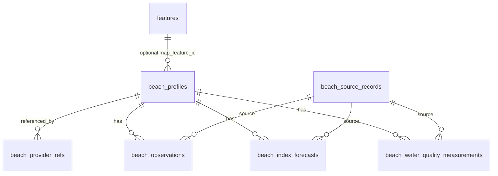

# 해수욕장 통합 스키마

해수욕장 정보는 `python-krtour-map` feature와 축제 데이터와 다른 형태로 관리한다. 해수욕장은 여행 일정에 추가될 수 있는 리소스지만, 수온·파고·해수욕지수·수질 적합 여부처럼 장소 자체가 아닌 계절성/관측성 데이터가 함께 붙는다. 따라서 TripMate의 통합 기준은 `beach_profiles`이며, 필요할 때만 feature id를 nullable `map_feature_id`로 연결한다.

## 설계 원칙

- 공통 feature 계약은 `python-krtour-map`의 [Feature model](https://github.com/digitie/python-krtour-map/blob/main/docs/feature-model.md)을 따른다.
- `beach_profiles`는 해수욕장 도메인 사전이다.
- 기상청 해수욕장 카탈로그처럼 이미 place feature로 승격된 원천은 `map_feature_id`로 연결한다.
- KHOA/해양수산부 원천은 먼저 `beach_profiles`로 적재하고, 자동으로 feature를 만들지 않는다.
- provider 원문은 `beach_source_records`에 저장하되 인증키는 마스킹한다.
- 도로명주소코드는 Juso 건물명 정확 일치 1건일 때만 채운다.
- 좌표는 EPSG:4326 `longitude`, `latitude` 순서로 표준화한다.

## 테이블 관계

## `beach_profiles`

통합 해수욕장 프로필이다.

주요 컬럼:

- `id`: UUID PK
- `canonical_key`: 이름+좌표 또는 provider id 기반 내부 key
- `display_name`, `normalized_name`
- `map_feature_id`: nullable feature id. 기존 feature와 연결할 때만 사용
- `representative_provider`, `representative_dataset_key`
- `longitude`, `latitude`, `geom`
- `legal_dong_code`, `sigungu_code`, `sido_code`
- `road_name_code`, `road_address_management_no`, `road_address`
- `address_snapshot`, `address_mapping_method`
- `beach_width_m`, `beach_length_m`, `beach_material`
- `homepage_url`, `homepage_name`, `image_url`, `emergency_contact`
- `source_specific_attributes`
- `collected_at`, `is_active`

## `beach_provider_refs`

원천 식별자와 통합 프로필을 연결한다.

unique:

- `provider`
- `provider_dataset_key`
- `provider_beach_id`

예:

- `khoa / khoa_beach_observation / BCH001`
- `khoa / khoa_beach_index_forecast / <placeCode 또는 이름+좌표 hash>`
- `data_go_kr / mof_beach_info / <num 또는 이름+좌표 hash>`
- `data_go_kr / mof_beach_water_quality / <num 또는 이름+좌표 hash>`
- `kma / kma_beach_catalog / <beach_num>`

## `beach_source_records`

원천 raw snapshot이다.

unique:

- `provider`
- `dataset_key`
- `source_record_id`
- `response_hash`

`request_params`에는 인증키를 `***`로 저장한다. raw payload에는 provider 응답을 보존해 재처리와 schema drift 확인에 사용한다.

## `python-krtour-map` feature projection

Dagster beach ETL은 raw/domain 저장 후 필요할 때 `beach_profiles`를 `python-krtour-map`의 `features`에 투영한다.

- `feature_id`: `beach:{beach_profiles.id}`
- `kind`: `place`
- `category`: `beach`
- `coord`, `geom`: `beach_profiles.longitude/latitude`
- `detail.latest_observation`: 최신 KHOA 관측값
- `detail.upcoming_index_forecasts`: 가까운 KHOA 해수욕지수 예보
- `raw_refs`: KHOA/MOF/KMA provider reference 목록

KHOA observation/index ETL은 12시간 캐시 창 안에서는 provider API를 다시 호출하지 않고 기존 raw/domain row를 재사용한다. 기본 Dagster 일정은 관측 06:20/18:20, 지수 06:30/18:30이다.

## `beach_observations`

KHOA 해수욕장 관측값이다.

unique:

- `provider`
- `provider_beach_id`
- `observed_at`

저장 정보:

- 관측소명
- 관측시각
- 조석
- 파고
- 수온
- 풍속
- 풍향
- day1/day2/day3 상태 JSON
- quota snapshot

## `beach_index_forecasts`

KHOA 해수욕지수 예측값이다.

unique:

- `provider`
- `provider_dataset_key`
- `beach_id`
- `forecast_date`
- `forecast_slot`

저장 정보:

- 해수욕점수
- 해수욕지수
- 최고파고
- 평균수온
- 평균기온
- 최고풍속

## `beach_water_quality_measurements`

해양수산부 해수욕장 수질 적합 여부다.

unique:

- `provider`
- `source_record_key`

저장 정보:

- 조사연도
- 조사일자
- 조사회차
- 조사종류
- 조사지점/상세
- 대장균/장구균 결과
- 수질 적합 여부
- 좌표와 주소 매핑 결과

## 공개 API 조합

`GET /public/beaches`는 `beach_profiles`를 기준으로 아래 데이터를 붙여 반환한다.

- `beach_provider_refs`의 provider 목록
- 최신 `beach_observations`
- 오늘 이후 `beach_index_forecasts`
- 최신 `beach_water_quality_measurements`
- `map_feature_id`가 있는 경우 최신 `weather_serving_beach` category 값

## 병합 규칙

1. provider ref가 있으면 같은 `beach_profile`을 갱신한다.
2. provider ref가 없으면 정규화 이름과 좌표 근접성을 사용한다.
3. 좌표가 없으면 정규화 이름만 사용한다.
4. 새 row가 필요하면 `canonical_key`를 만든다.
5. 주소 매핑은 더 신뢰도 높은 값만 덮어쓴다.

주소 매핑 신뢰도:

1. `juso_building_name_in_legal_dong`
2. `postgis_point_in_polygon`
3. `postgis_nearest_boundary_5km`
4. `unmapped`

## 완료/검증 기준

- Alembic migration `20260428_0020` 적용
- `Beach*` 모델이 metadata에 등록
- ETL loader idempotency 테스트 통과
- Dagster job contract 테스트 통과
- `GET /public/beaches` 통합 응답 테스트 통과
- `docs/data-sources/beach-sources.md`와 구현 스케줄 동기화
