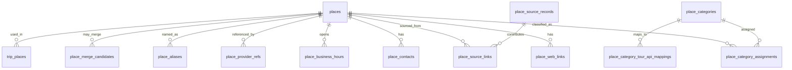

# 장소 도메인 DB 스키마 설계안

> 이 문서는 기존 장소 중심 스키마의 배경과 장소 ETL 기준을 설명하는 참고 문서다. 2026-04-29부터 실제 구현 기준은 `docs/architecture/map-feature-schema.md`의 `map_features + place_details + source_records` 구조다. 아래의 `places`, `place_source_records` 설명은 레거시 구조 이해와 마이그레이션 맥락을 위한 기록이다.

## 목적

이 문서는 TripMate의 내부 표준 장소(`place`) 스키마 기준안이다.

TripMate에서 “장소”는 공공데이터포털, 기상청 추천 관광코스, 한국도로공사 휴게소, OpiNet 주유소, Kakao/Naver/Google 같은 외부 provider에서 들어오는 장소성 데이터를 정규화해 사용자에게 검색·추천·지도 마커로 노출하기 위한 내부 엔티티다.

사용자가 여행 일정에 넣는 방문 장소(`trip_places`)는 사용자 메모, 사용자 지정 이름, 날짜별 참여자, 순서가 붙는 여행 도메인 데이터다. 내부 표준 장소(`places`)는 그 방문 장소가 참조할 수 있는 정규화된 장소 사전이다. 따라서 두 개념은 분리한다.

## 핵심 요구사항

- 장소는 대한민국 내 장소만 다룬다.
- 장소는 고유한 내부 ID를 가진다.
- 사용자 검색/지도 노출용 장소는 법정동코드, 도로명코드, 상세 주소, 좌표, 대표 카테고리, 상호명 또는 장소명을 가진다.
- 전화번호, 영업시간/영업일, 사업자번호, 웹사이트/SNS, Naver/Kakao/Google Maps 링크는 선택값이다.
- 카테고리는 4단계, 총 8자리 코드다. 각 단계는 2자리이고, 숫자로 보이더라도 선행 0 보존을 위해 `char(8)`로 저장한다.
- 해당 단계가 없거나 아직 확정되지 않은 경우 해당 2자리는 `00`으로 저장한다.
- 한 장소는 대표 카테고리 1개와 부 카테고리 최대 5개를 가질 수 있다.
- 한 장소는 1단계 부모 장소를 가질 수 있다. 예: 자연휴양림 안의 “숲속의 집”.
- 한 장소는 대표 웹사이트 1개와 추가 웹사이트/SNS 최대 5개를 가질 수 있다.

## 모델링 원칙

### raw, staging, canonical 분리

외부 데이터는 바로 지도 노출 테이블 하나에만 넣지 않는다.

1. `source_records`: provider 또는 공공데이터 원천 레코드 보관/감사용.
2. `feature_mapping_candidates`: 여러 원천이 같은 지도 객체일 가능성이 있을 때 검토 후보.
3. `map_features`: 앱 검색, 지도, 여행 일정 연결에 사용하는 내부 표준 지도 객체.
4. `place_details`: 장소형 feature의 운영 상태, 세부 검증 상태, 장소 특화 JSON.

Kakao/Naver/Google 같은 상업 provider의 원문 전체 응답은 `docs/data-sources.md`의 TTL cache 정책을 따른다. 상호명, 주소, 전화번호처럼 잘 바뀌지 않는 안정 필드는 내부 표준 필드로 승격할 수 있지만, 원문 전체 장기 저장은 하지 않는다.

공공데이터포털, 한국도로공사처럼 장기 저장이 허용되는 데이터는 원문 재처리와 diff 검증을 위해 raw 레코드를 보관할 수 있다.

### 주소 기준

장소 주소는 `docs/architecture/address-schema.md` 기준을 따른다.

- 앱 내 주소 기준 key는 `legal_dong_code`, `road_name_code`, `administrative_dong_code`, `road_address_management_no`다.
- 모든 주소 코드는 문자열로 저장한다.
- 좌표는 EPSG:4326, `lon`, `lat`, `geometry(Point, 4326)` 순서로 저장한다.
- 법정동 판정은 VWorld 경계와 PostGIS point-in-polygon 결과를 우선한다.
- provider 주소 문자열과 Juso 주소 DB의 fuzzy match는 기본 정책이 아니다.

사용자 검색과 지도에 노출되는 canonical 장소는 가능한 한 법정동코드와 도로명코드까지 해석된 상태여야 한다. 다만 공공데이터 중 도로명코드가 없거나 provider 주소가 불완전한 경우를 잃지 않기 위해 DB 컬럼은 nullable로 두고, `place_details.address_resolution_status`와 `map_features.is_visible`로 노출 여부를 제어한다.

기상청 전국 해수욕장 카탈로그는 장소 원천으로 취급한다. 원천 xlsx는 해수욕장명, 기상청 `beach_num`, DFS 격자(`nx`, `ny`), WGS84 좌표만 제공하고 주소 문자열은 제공하지 않는다. 따라서 해수욕장은 `map_features(feature_type='place', category_code='01050100')`와 `place_details(place_kind='tourist_spot')`로 저장한다. 법정동은 PostGIS point-in-polygon으로 먼저 맞추고 해상/모래사장 좌표로 인해 실패하면 약 5km 이내 가장 가까운 법정동 경계를 보조 매핑으로 사용한다. 도로명주소코드/도로명주소관리번호는 같은 법정동 내 Juso 건물명 정확 일치가 1건일 때만 채운다. 일치하지 않으면 좌표 기반 장소로 보존하고 도로명주소코드는 추정 생성하지 않는다.

추천 기본값:

- `legal_dong_code`, 좌표, 이름, 대표 카테고리가 없으면 `is_visible = false`.
- `road_name_code`가 없으면 상세 주소 검색 정확도가 낮아지므로 `place_details.address_resolution_status = partial` 또는 `coordinate_only`로 둔다.
- 사용자가 직접 저장한 여행 방문 장소는 주소 FK가 없어도 snapshot 주소와 좌표가 있으면 저장 가능해야 한다.

## ERD 개요

## 핵심 테이블

### `places`

내부 표준 장소의 중심 테이블이다. 검색, 지도, 여행 방문 장소 연결은 이 테이블을 우선 참조한다.

| 컬럼 | 타입 | 필수 | 설명 |
| --- | --- | --- | --- |
| `id` | UUID PK | Y | 내부 장소 ID |
| `public_id` | varchar(32) unique | Y | URL/API 노출용 짧은 안정 ID. UUID 원문 노출을 줄이기 위한 값 |
| `parent_place_id` | UUID FK nullable | N | 부모 장소. 1단계 부모/자식만 허용 |
| `name` | varchar(200) | Y | 표준 장소명 또는 상호명 |
| `display_name` | varchar(200) | Y | 화면 표시명. 기본은 `name`, 필요 시 정제명 |
| `normalized_name` | varchar(200) | Y | 검색/중복 후보 산출용 정규화 이름 |
| `place_kind` | varchar(40) | Y | `public_facility`, `business`, `tour_point`, `transport`, `accommodation`, `natural`, `custom_imported` 등 |
| `primary_category_code` | char(8) FK | Y | 대표 TripMate 장소 카테고리 |
| `legal_dong_code` | varchar(10) FK nullable | N | 법정동코드 |
| `road_name_code` | varchar(12) nullable | N | 도로명코드 |
| `administrative_dong_code` | varchar(10) nullable | N | 행정동코드 |
| `road_address_management_no` | varchar(64) FK nullable | N | 도로명주소관리번호 |
| `road_address` | varchar(500) nullable | N | 도로명주소 문자열 snapshot |
| `jibun_address` | varchar(500) nullable | N | 지번주소 문자열 snapshot |
| `detail_address` | varchar(255) nullable | N | 상세 주소. 사용자 노출용 canonical 장소에서는 가능한 한 채우되, 자연경관·대형 시설처럼 상세 주소가 없는 경우를 위해 nullable로 둔다 |
| `address_snapshot` | varchar(700) | Y | 저장/정규화 당시 전체 주소 문자열 |
| `address_resolution_status` | varchar(32) | Y | `resolved`, `partial`, `coordinate_only`, `unresolved`, `invalid` |
| `lon` | numeric(12,8) | Y | 경도 |
| `lat` | numeric(12,8) | Y | 위도 |
| `geom` | geometry(Point, 4326) | Y | PostGIS 위치 |
| `phone` | varchar(80) nullable | N | 대표 전화번호 |
| `business_registration_no` | varchar(20) nullable | N | 사업자등록번호. 공식/공개 데이터에서 확인된 경우만 저장 |
| `opened_on` | date nullable | N | 개업일 또는 운영 시작일 |
| `closed_on` | date nullable | N | 폐업일 또는 운영 종료일 |
| `operation_status` | varchar(32) | Y | `operating`, `temporarily_closed`, `closed`, `unknown` |
| `verification_status` | varchar(32) | Y | `unverified`, `provider_verified`, `public_data_verified`, `admin_verified`, `user_reported` |
| `quality_score` | integer nullable | N | 검색/추천 품질 점수. 0~100 |
| `is_searchable` | boolean | Y | 사용자 신규 검색 노출 여부 |
| `is_map_visible` | boolean | Y | 지도 기본 마커 노출 여부 |
| `is_active` | boolean | Y | 내부 사용 여부 |
| `first_seen_at` | timestamptz | Y | 처음 수집/생성된 시각, KST |
| `last_seen_at` | timestamptz nullable | N | provider 또는 공공데이터에서 마지막 확인된 시각, KST |
| `last_verified_at` | timestamptz nullable | N | 내부 검증 완료 시각, KST |
| `created_at` | timestamptz | Y | 생성 시각, KST |
| `updated_at` | timestamptz | Y | 수정 시각, KST |

제약:

- `primary_category_code`는 `place_categories.category_code`를 참조한다.
- `parent_place_id <> id`.
- 부모 장소의 부모는 없어야 한다. 이 1단계 제한은 service layer에서 검증한다.
- `geom`은 `ST_SetSRID(ST_MakePoint(lon, lat), 4326)`와 일치해야 한다.
- 검색 노출 가능 장소는 최소한 `name`, `primary_category_code`, `lon`, `lat`, `legal_dong_code`를 가져야 한다.

권장 인덱스:

- `GIST (geom)`
- `BTREE (legal_dong_code)`
- `BTREE (road_name_code)`
- `BTREE (primary_category_code)`
- `BTREE (operation_status, is_searchable)`
- 이름 검색용 trigram 또는 tsvector 인덱스

### `place_categories`

TripMate 내부 장소 분류 코드 테이블이다.

| 컬럼 | 타입 | 필수 | 설명 |
| --- | --- | --- | --- |
| `category_code` | char(8) PK | Y | 8자리 TripMate 카테고리 코드 |
| `tier1_code` | char(2) | Y | 1단계 코드 |
| `tier2_code` | char(2) | Y | 2단계 코드 |
| `tier3_code` | char(2) | Y | 3단계 코드 |
| `tier4_code` | char(2) | Y | 4단계 코드 |
| `tier1_name` | varchar(80) | Y | 1단계 이름 |
| `tier2_name` | varchar(80) | N | 2단계 이름 |
| `tier3_name` | varchar(80) | N | 3단계 이름 |
| `tier4_name` | varchar(120) | N | 4단계 이름 |
| `depth` | smallint | Y | 실제 깊이. 0~4 |
| `parent_category_code` | char(8) FK nullable | N | 상위 카테고리 |
| `sort_order` | integer | Y | 화면 표시 순서 |
| `is_active` | boolean | Y | 사용 여부 |
| `created_at` | timestamptz | Y | 생성 시각 |
| `updated_at` | timestamptz | Y | 수정 시각 |

제약:

- `category_code ~ '^[0-9]{8}$'`.
- `tier*_code`는 모두 2자리 숫자 문자열이다.
- 미분류 루트는 `00000000`으로 둔다.
- 특정 단계가 없으면 해당 단계 이후는 `00`으로 채운다.

### `place_category_assignments`

대표 카테고리 외 부 카테고리 최대 5개를 저장한다.

| 컬럼 | 타입 | 필수 | 설명 |
| --- | --- | --- | --- |
| `id` | UUID PK | Y | row ID |
| `place_id` | UUID FK | Y | 장소 |
| `category_code` | char(8) FK | Y | 카테고리 |
| `assignment_role` | varchar(16) | Y | `primary`, `secondary` |
| `sort_order` | smallint | Y | `primary`는 0, `secondary`는 1~5 |
| `confidence` | integer nullable | N | 0~100. 자동 분류 신뢰도 |
| `assigned_by` | varchar(40) | Y | `system`, `etl`, `admin`, `provider`, `user_suggested` |
| `created_at` | timestamptz | Y | 생성 시각 |

제약:

- 장소당 `primary`는 정확히 1개다.
- 장소당 `secondary`는 최대 5개다.
- `(place_id, category_code)` unique.
- `places.primary_category_code`와 `primary` assignment는 service layer 또는 trigger로 동기화한다.

### `place_web_links`

대표 웹사이트와 추가 웹사이트/SNS/provider 링크를 저장한다.

| 컬럼 | 타입 | 필수 | 설명 |
| --- | --- | --- | --- |
| `id` | UUID PK | Y | row ID |
| `place_id` | UUID FK | Y | 장소 |
| `link_type` | varchar(40) | Y | `official`, `sns`, `naver_map`, `kakao_map`, `google_map`, `visitkorea`, `booking`, `other` |
| `provider` | varchar(40) nullable | N | `naver`, `kakao`, `google`, `visitkorea`, `instagram`, `facebook` 등 |
| `url` | text | Y | 링크 URL |
| `title` | varchar(200) nullable | N | 링크 표시명 |
| `is_primary` | boolean | Y | 대표 링크 여부 |
| `sort_order` | smallint | Y | 대표는 0, 추가는 1~5 |
| `last_checked_at` | timestamptz nullable | N | 링크 확인 시각 |
| `created_at` | timestamptz | Y | 생성 시각 |
| `updated_at` | timestamptz | Y | 수정 시각 |

제약:

- 장소당 `official` 또는 일반 웹사이트 대표 링크는 최대 1개다.
- 대표 링크 외 추가 웹사이트/SNS는 최대 5개다.
- Naver/Kakao/Google Maps/VisitKorea 링크는 provider 참조 성격도 있으므로 `place_provider_refs`와 함께 저장할 수 있다.

### `place_contacts`

전화번호, 이메일 등 연락처를 확장 가능하게 저장한다. 현재 필수 요구는 전화번호 하나지만, 공공데이터마다 연락처 필드가 다르므로 별도 테이블을 둔다.

| 컬럼 | 타입 | 필수 | 설명 |
| --- | --- | --- | --- |
| `id` | UUID PK | Y | row ID |
| `place_id` | UUID FK | Y | 장소 |
| `contact_type` | varchar(32) | Y | `phone`, `fax`, `email` |
| `value` | varchar(255) | Y | 연락처 값 |
| `is_primary` | boolean | Y | 대표 여부 |
| `source` | varchar(80) nullable | N | 출처 |
| `created_at` | timestamptz | Y | 생성 시각 |
| `updated_at` | timestamptz | Y | 수정 시각 |

`places.phone`은 빠른 조회용 대표 전화번호 snapshot이고, 상세 연락처는 이 테이블을 기준으로 한다.

### `place_business_hours`

일반 영업시간, 특정 날짜 운영, 휴무일을 표현한다.

| 컬럼 | 타입 | 필수 | 설명 |
| --- | --- | --- | --- |
| `id` | UUID PK | Y | row ID |
| `place_id` | UUID FK | Y | 장소 |
| `rule_type` | varchar(32) | Y | `weekly`, `specific_date`, `date_range`, `holiday`, `note` |
| `day_of_week` | smallint nullable | N | 월요일 1 ~ 일요일 7 |
| `specific_date` | date nullable | N | 특정 날짜 |
| `start_date` | date nullable | N | 기간 시작 |
| `end_date` | date nullable | N | 기간 종료 |
| `open_time` | time nullable | N | 시작 시간 |
| `close_time` | time nullable | N | 종료 시간 |
| `is_closed` | boolean | Y | 휴무 여부 |
| `last_order_time` | time nullable | N | 라스트오더 |
| `note` | varchar(500) nullable | N | 비정형 운영 안내 |
| `source` | varchar(80) nullable | N | 출처 |
| `created_at` | timestamptz | Y | 생성 시각 |
| `updated_at` | timestamptz | Y | 수정 시각 |

여행 앱에서는 “오늘 열었는지”보다 “방문 예정일 오전/오후에 운영 가능성이 있는지”가 중요하다. 따라서 날짜별 예외와 비정형 안내를 함께 저장한다.

### `place_provider_refs`

provider별 장소 ID, URL, 마지막 확인 시각을 저장한다.

| 컬럼 | 타입 | 필수 | 설명 |
| --- | --- | --- | --- |
| `id` | UUID PK | Y | row ID |
| `place_id` | UUID FK | Y | 내부 장소 |
| `provider` | varchar(40) | Y | `kakao`, `naver`, `google`, `data_go_kr`, `kma`, `ex`, `opinet` 등 |
| `provider_place_id` | varchar(255) nullable | N | provider 장소 ID 또는 content ID |
| `provider_dataset_key` | varchar(120) nullable | N | 공공데이터 dataset key |
| `url` | text nullable | N | provider 페이지 링크 |
| `stable_name` | varchar(255) nullable | N | provider가 준 이름 snapshot |
| `stable_address` | varchar(500) nullable | N | provider가 준 주소 snapshot |
| `stable_phone` | varchar(80) nullable | N | provider가 준 전화번호 snapshot |
| `last_fetched_at` | timestamptz nullable | N | 마지막 조회 시각 |
| `expires_at` | timestamptz nullable | N | TTL cache 만료 시각. 장기 저장 금지 provider에 사용 |
| `created_at` | timestamptz | Y | 생성 시각 |
| `updated_at` | timestamptz | Y | 수정 시각 |

제약:

- `(provider, provider_place_id)`는 provider ID가 있는 경우 unique 후보가 된다.
- 같은 내부 장소에 같은 provider의 대표 참조는 하나만 두는 것을 권장한다.
- 원문 전체는 이 테이블에 넣지 않는다. 원문은 `place_source_records` 또는 provider cache 정책을 따른다.

### `place_source_records`

원천 데이터 레코드다. 재처리, 감사, diff 검증, 중복 병합 판단에 사용한다.

| 컬럼 | 타입 | 필수 | 설명 |
| --- | --- | --- | --- |
| `id` | UUID PK | Y | raw/source record ID |
| `dataset_key` | varchar(120) | Y | `public_forest_lodge`, `public_museum_art_gallery` 등 |
| `provider` | varchar(40) | Y | `data_go_kr`, `kakao`, `naver`, `google`, `manual_upload` 등 |
| `source_record_id` | varchar(255) nullable | N | 원천 row ID, content ID, provider ID |
| `source_version` | varchar(80) nullable | N | 파일 기준월, API 기준일, batch ID |
| `raw_payload` | jsonb nullable | N | 장기 저장 가능한 provider만 원문 저장 |
| `raw_payload_hash` | varchar(128) | Y | 원문 또는 정규화 입력 hash |
| `collected_at` | timestamptz | Y | 수집 시각, KST |
| `expires_at` | timestamptz nullable | N | TTL 대상이면 만료 시각 |
| `created_at` | timestamptz | Y | 생성 시각 |

Kakao/Naver/Google 원문 전체는 장기 저장하지 않는다. 이 경우 `raw_payload`는 비우거나 TTL cache 테이블에만 저장하고, hash와 안정 필드만 내부 표준 테이블로 승격한다.

### `place_ingest_candidates`

원천 레코드를 내부 표준 장소로 승격하기 전 임시 후보 테이블이다. 주소, 좌표, 카테고리, 중복 후보를 해석하는 동안 사용한다.

| 컬럼 | 타입 | 필수 | 설명 |
| --- | --- | --- | --- |
| `id` | UUID PK | Y | 후보 ID |
| `source_record_id` | UUID FK nullable | N | 원천 레코드 |
| `dataset_key` | varchar(120) | Y | 데이터셋 key |
| `candidate_name` | varchar(255) | Y | 후보 장소명 |
| `candidate_address` | varchar(700) nullable | N | 원천 주소 문자열 |
| `candidate_lon` | numeric(12,8) nullable | N | 원천 경도 |
| `candidate_lat` | numeric(12,8) nullable | N | 원천 위도 |
| `candidate_geom` | geometry(Point, 4326) nullable | N | 원천 좌표 |
| `resolved_legal_dong_code` | varchar(10) nullable | N | 좌표 또는 주소로 해석한 법정동코드 |
| `resolved_road_name_code` | varchar(12) nullable | N | 해석한 도로명코드 |
| `resolved_road_address_management_no` | varchar(64) nullable | N | 해석한 도로명주소관리번호 |
| `suggested_category_code` | char(8) nullable | N | 추천 카테고리 |
| `matched_place_id` | UUID FK nullable | N | 기존 장소와 매칭된 경우 |
| `match_confidence` | integer nullable | N | 0~100 |
| `candidate_status` | varchar(32) | Y | `pending`, `ready`, `promoted`, `duplicate`, `rejected`, `needs_review` |
| `error_message` | text nullable | N | 해석 실패 이유 |
| `created_at` | timestamptz | Y | 생성 시각 |
| `updated_at` | timestamptz | Y | 수정 시각 |

이 테이블은 ETL 멱등성 확보와 운영 검토를 위한 완충 구간이다. `candidate_status = ready`인 후보만 `places`로 승격한다.

### `place_source_links`

한 내부 장소가 어떤 원천 레코드들에서 만들어졌는지 연결한다.

| 컬럼 | 타입 | 필수 | 설명 |
| --- | --- | --- | --- |
| `id` | UUID PK | Y | row ID |
| `place_id` | UUID FK | Y | 내부 장소 |
| `source_record_id` | UUID FK | Y | 원천 레코드 |
| `match_method` | varchar(40) | Y | `provider_id`, `admin_selected`, `coordinate_admin_area`, `address_code`, `name_address`, `manual` |
| `confidence` | integer | Y | 0~100 |
| `is_primary_source` | boolean | Y | 대표 출처 여부 |
| `created_at` | timestamptz | Y | 생성 시각 |

주소/좌표 기반 자동 매칭은 과도하게 공격적으로 하지 않는다. 동일 provider ID 또는 명확한 공공데이터 ID가 있으면 우선하고, 그 외에는 후보를 만들고 관리자 검토 또는 낮은 confidence로 둔다.

### `place_aliases`

검색용 별칭과 과거 이름을 저장한다.

| 컬럼 | 타입 | 필수 | 설명 |
| --- | --- | --- | --- |
| `id` | UUID PK | Y | row ID |
| `place_id` | UUID FK | Y | 장소 |
| `alias` | varchar(200) | Y | 별칭 |
| `alias_type` | varchar(32) | Y | `official_old_name`, `provider_name`, `user_search_term`, `abbreviation`, `english` |
| `source` | varchar(80) nullable | N | 출처 |
| `created_at` | timestamptz | Y | 생성 시각 |

### `place_merge_candidates`

중복 장소 후보를 바로 병합하지 않고 검토 대상으로 남긴다.

| 컬럼 | 타입 | 필수 | 설명 |
| --- | --- | --- | --- |
| `id` | UUID PK | Y | row ID |
| `place_id_a` | UUID FK | Y | 후보 A |
| `place_id_b` | UUID FK | Y | 후보 B |
| `reason` | varchar(80) | Y | `same_provider_id`, `nearby_same_name`, `same_address`, `admin_suggested` |
| `score` | integer | Y | 0~100 |
| `status` | varchar(32) | Y | `pending`, `merged`, `rejected`, `needs_review` |
| `created_at` | timestamptz | Y | 생성 시각 |
| `resolved_at` | timestamptz nullable | N | 처리 시각 |

## 카테고리 코드 체계

### 코드 구조

카테고리는 `AABBCCDD` 형식이다.

- `AA`: Tier 1
- `BB`: Tier 2
- `CC`: Tier 3
- `DD`: Tier 4

각 단계는 같은 부모 안에서 사용자 제공 표의 등장 순서대로 `01`부터 배정한다. 해당 단계가 없으면 `00`을 사용한다.

예:

- `01010101`: 관광 > 테마파크 > 놀이공원 > 대형 테마파크
- `01010102`: 관광 > 테마파크 > 놀이공원 > 중소형 놀이공원
- `01020101`: 관광 > 자연경관 > 산·계곡 > 국립공원
- `02020101`: 식음 > 카페 > 커피전문점 > 프랜차이즈 카페
- `03030101`: 숙박 > 휴양림 > 국립휴양림 > 산림청 운영
- `06040101`: 교통 > 휴게소 > 고속도로휴게소 > 한국도로공사 휴게소
- `00000000`: 미분류

### Tier 1 코드

| 코드 | 이름 |
| --- | --- |
| `00` | 미분류 |
| `01` | 관광 |
| `02` | 식음 |
| `03` | 숙박 |
| `04` | 온천·스파 |
| `05` | 편의 |
| `06` | 교통 |
| `07` | 의료 |

### Tier 2 코드

Tier 2 코드는 Tier 1 내부에서만 의미가 있다.

| Tier 1 | Tier 2 코드 | 이름 |
| --- | --- | --- |
| 관광 | `01` | 테마파크 |
| 관광 | `02` | 자연경관 |
| 관광 | `03` | 수목원·식물원 |
| 관광 | `04` | 문화시설 |
| 관광 | `05` | 국가유산 |
| 관광 | `06` | 액티비티 |
| 식음 | `01` | 음식점 |
| 식음 | `02` | 카페 |
| 숙박 | `01` | 호텔 |
| 숙박 | `02` | 리조트 |
| 숙박 | `03` | 휴양림 |
| 숙박 | `04` | 모텔 |
| 숙박 | `05` | 펜션 |
| 숙박 | `06` | 캠핑장 |
| 숙박 | `07` | 게스트하우스 |
| 온천·스파 | `01` | 온천 |
| 온천·스파 | `02` | 찜질방·사우나 |
| 온천·스파 | `03` | 스파·테라피 |
| 편의 | `01` | 편의점 |
| 편의 | `02` | 은행 |
| 편의 | `03` | 마트 |
| 편의 | `04` | 슈퍼마켓 |
| 교통 | `01` | 주차장 |
| 교통 | `02` | 주유소 |
| 교통 | `03` | 정류장 |
| 교통 | `04` | 휴게소 |
| 의료 | `01` | 병원 |
| 의료 | `02` | 약국 |

Tier 3와 Tier 4는 각 Tier 2 안에서 사용자 제공 표의 등장 순서를 따른다. 예를 들어 `관광 > 테마파크`의 Tier 3은 `놀이공원=01`, `워터파크=02`, `동물원·아쿠아리움=03`, `체험형 테마파크=04`다. `식음 > 음식점`의 Tier 3은 `한식=01`, `양식=02`, `일식=03`, `중식=04`, `아시안=05`, `패스트푸드=06`, `뷔페=07`, `주점=08`이다.

구현 시에는 이 문서의 코드 배정 규칙으로 seed 데이터를 생성하고, seed 결과를 리뷰 가능한 JSON 또는 CSV로 저장한다. 사람이 직접 8자리 코드를 하드코딩해 흩뿌리지 않는다.

## 외부 데이터별 연결 방식

### 공공데이터포털 장소 데이터

예: 전국 휴양림 정보, 전국 박물관/미술관 정보.

- 원천 레코드는 `place_source_records`에 저장한다.
- 데이터셋별 고유 ID가 있으면 `source_record_id`로 저장한다.
- 좌표가 있으면 PostGIS point-in-polygon으로 `legal_dong_code`를 판정한다.
- 주소 문자열이 있고 Juso key가 명확하면 `road_name_code`, `road_address_management_no`를 연결한다.
- 카테고리는 데이터셋 단위 기본값을 둔 뒤, 원천 필드로 세분화한다.
- 예: 전국 휴양림 정보는 기본 `숙박 > 휴양림`; 국립/공립/사립 필드가 있으면 Tier 3/4까지 세분화한다.
- 예: 전국 박물관/미술관 정보는 기본 `관광 > 문화시설`; 시설 구분에 따라 박물관/미술관·갤러리로 세분화한다.

현재 구현된 공공 장소 ETL 상세는 `docs/architecture/public-place-etl-schema.md`를 따른다.

구현된 테이블:

- `place_categories`
- `map_features`
- `place_details`
- `source_records`
- `map_feature_source_links`
- `map_feature_provider_refs`
- `map_feature_web_links`

구현된 dataset:

- `public_arboretum_basic`: 한국수목원정원관리원 수목원 기본관람정보
- `public_recreation_forest`: 전국휴양림표준데이터
- `public_museum_art_gallery`: 전국박물관미술관정보표준데이터
- `public_campground`: 전국야영(캠핑)장표준데이터

공통 컬럼으로 승격하지 않은 장소 유형별 세부값은 `place_details.extra` JSONB에 저장한다. 예를 들어 수목원의 대표수종, 휴양림의 입장료와 주요시설, 박물관의 관람료와 휴관정보, 캠핑장의 사이트 수와 안전시설은 JSONB에 보관한다. 검색/필터/정렬에 자주 쓰게 된 필드는 후속 migration에서 typed column 또는 별도 detail table로 승격한다.

### Kakao/Naver/Google 장소 정보

- provider raw 전체는 TTL cache 정책을 따른다.
- 안정 필드인 상호명, 주소, 전화번호, 좌표, provider 장소 ID, provider URL은 `places`, `place_provider_refs`, `place_web_links`로 승격할 수 있다.
- 리뷰는 3개월 저장 후, 여행 계획 어디에도 포함되지 않은 상태로 3개월이 지나면 삭제한다.
- provider별 카테고리는 TripMate 8자리 카테고리로 매핑하되, confidence를 함께 저장한다.
- provider 간 정보가 충돌하면 사용자가 선택한 provider 또는 공공데이터 검증 값을 우선한다.

### 휴게소, 주유소, 날씨 데이터와의 관계

- 한국도로공사 휴게소 master는 교통 > 휴게소 카테고리의 장소 후보로 승격할 수 있다.
- OpiNet 주유소 후보는 교통 > 주유소 카테고리의 장소 후보로 승격할 수 있다.
- 날씨, 대기질, 기상특보는 장소 자체가 아니라 지역/예보구역/측정소 기준 데이터다. 저장 장소와 사용자 여행 일정 주변에 보여줄 수 있지만, 날씨 데이터 자체를 `places`로 만들지 않는다.
- 기상청 추천 관광코스의 관광지 좌표는 장소 후보로 승격 가능하다. 이때 주소 매핑은 좌표 기반 법정동 판정을 기본으로 한다.

## 검색과 노출

사용자에게 노출하는 장소 검색은 `places`를 기준으로 한다.

검색 경로:

- 키워드 검색: 이름, 별칭, 주소, provider 안정 필드.
- 지역 검색: 법정동코드, 시군구 코드, VWorld 경계.
- 카테고리 검색: 대표/부 카테고리.
- 주변 검색: 좌표와 행정구역 기반 근사 또는 PostGIS 거리 검색. UI 문구에서 근사 여부를 명시한다.
- 부모 장소 검색: 특정 자연휴양림 안의 객실/시설처럼 `parent_place_id`로 묶는다.

검색 노출 제외:

- `is_searchable = false`
- `operation_status = closed`
- `address_resolution_status = invalid`
- provider TTL이 만료됐고 내부 안정 필드로 승격되지 않은 cache-only 후보

## 여행 방문 장소와의 연결

`trip_places`는 사용자 일정에 저장한 방문 장소다. `trip_places.place_id`를 nullable FK로 추가해 내부 표준 장소와 연결한다.

원칙:

- 사용자가 검색 결과에서 장소를 선택하면 `trip_places.place_id`를 채운다.
- 사용자가 지도 클릭으로 임의 장소를 추가하면 `place_id` 없이 snapshot 주소/좌표만 저장할 수 있다.
- 사용자가 임의 장소를 나중에 표준 장소로 승격하거나 기존 장소와 연결하면 `place_id`를 채운다.
- 여행 당시 이름, 주소, 좌표는 snapshot으로 보관한다. 표준 장소가 폐업/주소 변경되어도 과거 여행 기록은 깨지지 않아야 한다.
- `trip_place_data_refs`는 표준 장소로 승격되지 않은 개별 ETL row 또는 부가 데이터 연결에 사용한다.

## 데이터 품질과 병합 정책

자동 병합은 보수적으로 한다.

자동 병합 가능 후보:

- 같은 provider의 같은 `provider_place_id`.
- 같은 공공데이터 dataset의 같은 `source_record_id`.

검토 후보로만 남길 조건:

- 같은 이름이고 좌표가 매우 가까운 경우.
- 주소 문자열이 같지만 provider ID가 다른 경우.
- 부모/자식 장소일 가능성이 있는 경우.

병합 시 보존:

- 모든 `place_source_links`.
- provider 참조와 링크.
- 사용자 여행 방문 장소의 snapshot.
- 과거 이름은 `place_aliases`에 보존.

## 구현 시 테스트 기준

장소 스키마 구현 시 최소 테스트는 다음을 포함한다.

- 카테고리 코드가 항상 8자리 문자열로 저장되는지.
- `00` 패딩과 unknown category가 손실되지 않는지.
- 장소당 대표 카테고리 1개, 부 카테고리 최대 5개 제약이 지켜지는지.
- 부모/자식 장소가 1단계만 허용되는지.
- 대표 웹사이트 1개와 추가 웹사이트/SNS 최대 5개 제약이 지켜지는지.
- 좌표에서 `geom` 생성 시 lon/lat 순서가 바뀌지 않는지.
- 법정동 point-in-polygon 결과가 `legal_dong_code`에 반영되는지.
- provider raw 장기 저장 금지 정책이 Kakao/Naver/Google cache에 적용되는지.
- 공공데이터 raw 재처리가 동일한 `places`를 멱등적으로 갱신하는지.
- `trip_places.place_id`가 없어도 여행 장소 snapshot이 저장되는지.
- 표준 장소가 폐업/비노출 처리되어도 기존 여행 장소가 깨지지 않는지.

## 의사결정 필요 항목

1. canonical `places`에서 `road_name_code`와 `detail_address`를 DB `NOT NULL`로 강제할지, 현재 추천처럼 nullable + `address_resolution_status`로 관리할지 결정해야 한다. 추천은 데이터 유실을 막기 위해 nullable + 노출 제어다.
2. 축제/행사 카테고리를 현재 표에 추가할지 결정해야 한다. 전국문화축제표준데이터를 지도/여행계획에서 충분히 다루려면 `관광 > 축제·행사` 신설을 추천한다.
3. 쇼핑을 `편의` 안에서 처리할지, 별도 Tier 1 `쇼핑`을 만들지 결정해야 한다. 현재 표 기준으로는 전통시장/마트 중심만 표현 가능하다.
4. 사업자등록번호를 관리자 검증용으로만 저장할지, 일반 검색/상세 화면에 노출할지 결정해야 한다. 추천은 저장 가능하되 기본 UI 비노출이다.
5. 사용자 제보로 장소를 수정하는 흐름을 둘지 결정해야 한다. 추천은 `user_suggested` 상태로 후보를 만들고 관리자 검토 후 반영하는 방식이다.
6. 외부 provider 링크 중 어떤 것을 장소 상세의 대표 링크로 우선할지 결정해야 한다. 추천은 공식 홈페이지, Kakao/Naver/Google 순서다.
