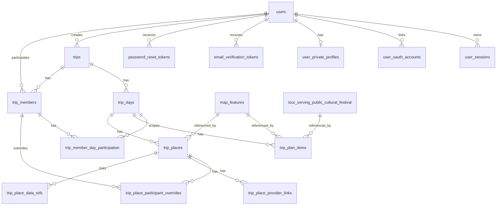

# 사용자, 참여자, 여행 계획 DB 스키마 설계안

## 목적

이 문서는 TripMate의 사용자 계정, 이메일 인증, 관리자 사용자 관리, 여행 참여자, 여행 일정별 참여 여부, 여행 장소 저장 구조의 DB 설계 기준안이다.

현재 구현은 `users`, `sessions`, `email_verification_tokens`, `trips`, `trip_days`, `trip_plan_items`를 갖고 있다. 일반 사용자 가입 요청, 일반 사용자 httpOnly cookie 로그인/로그아웃/세션 확인, 관리자 사용자 조회/상태 변경은 구현됐다. 이메일 인증 링크 소비와 초대 참여자 첫 비밀번호 설정은 후속 구현 대상이다.

## 핵심 요구사항

- 사용자는 이메일로 로그인한다.
- Google/Naver/Kakao 소셜 로그인은 provider 고유 사용자와 TripMate 사용자를 별도 연결 테이블로 묶는다.
- 비회원 사용은 지원하지 않는다.
- 사용자 등급은 관리자, 여행계획 작성자, 참여자로 시작하되 추후 세분화될 수 있어야 한다.
- 여행계획 작성자는 직접 가입하고 로그인할 수 있다.
- 참여자는 작성자가 이메일로 먼저 추가할 수 있다.
- 초대된 참여자는 추후 그 이메일로 로그인할 수 있고, 첫 로그인 때 비밀번호를 설정한다.
- 가입 시 입력하는 기본 정보는 이메일, 닉네임, 이름, 생년월, 성별, 거주지 시군구다.
- 상세 주소, 생년월일 같은 민감하거나 부가적인 정보는 별도 상세정보 테이블에 저장하고 필수값으로 두지 않는다.
- 가입 시 이메일 인증을 수행한다.
- 이메일 발송은 Gmail 같은 외부 SMTP 서버를 사용한다.
- 관리자는 사용자 목록 조회, 사용자 추가/삭제, 비밀번호 초기화를 할 수 있다.
- 사용자는 여러 여행계획을 만들 수 있다.
- 여행에는 기존 사용자와 초대 사용자를 모두 참여자로 넣을 수 있다.
- 여행 중 날짜별로 참여자가 바뀔 수 있다.
- 여행 장소는 기본적으로 해당 날짜 참여자 전체가 참여하지만, 장소별로 참여자를 넣고 뺄 수 있어야 한다.
- 여행 장소는 주소 코드, 좌표, 주소, 이름, 메모, provider 링크, ETL로 적재된 장소 데이터와 연결할 수 있어야 한다.

## 권장 모델링 방향

사용자 권한은 두 층으로 나눈다.

1. 시스템 역할: 앱 전체 권한이다. 예: `admin`, `planner`, `participant`.
2. 여행별 역할: 특정 여행 안에서의 권한이다. 예: `owner`, `editor`, `participant`.

이렇게 나누는 이유는 같은 사람이 어떤 여행에서는 작성자이고, 다른 여행에서는 참여자일 수 있기 때문이다. 또한 관리자는 시스템 전체 권한이며 특정 여행의 작성자 역할과는 성격이 다르다.

초대받은 참여자는 별도 임시 테이블에만 두지 않고 `users`에 `invited` 상태로 먼저 만든다. 같은 이메일이 여러 여행에 초대될 수 있고, 나중에 첫 로그인할 때 같은 계정으로 자연스럽게 이어지기 때문이다. 이 경우 `password_hash`는 첫 비밀번호 설정 전까지 `NULL`을 허용한다.

## ERD 개요

## 사용자 계정 스키마

### `users`

로그인과 권한 판단의 중심 테이블이다.

| 컬럼 | 타입 | 필수 | 설명 |
| --- | --- | --- | --- |
| `id` | UUID PK | Y | 내부 사용자 ID |
| `email` | varchar(320) unique | Y | 로그인 식별자. 소문자 정규화본 저장 |
| `email_verified_at` | timestamptz | N | 이메일 인증 완료 시각 |
| `password_hash` | varchar(255) | N | 비밀번호 해시. 초대 상태 사용자는 첫 설정 전까지 `NULL` |
| `account_status` | varchar(32) | Y | `pending_email_verification`, `invited`, `active`, `disabled`, `deleted` |
| `system_role` | varchar(32) | Y | `admin`, `planner`, `participant` |
| `nickname` | varchar(80) | Y | 서비스 표시 닉네임 |
| `name` | varchar(80) | Y | 실명 또는 사용자가 입력한 이름 |
| `birth_year_month` | char(6) | N | `YYYYMM`. 가입 필수로 할지 최종 결정 필요 |
| `gender` | varchar(32) | N | `female`, `male`, `non_binary`, `no_answer` 등 |
| `residence_sigungu_code` | varchar(10) FK nullable | N | 거주지 시군구 코드. `address_code_standard.legal_dong_code` 중 시군구 level 참조 |
| `created_by_user_id` | UUID FK nullable | N | 관리자가 만들거나 작성자가 초대한 경우 생성자 |
| `last_login_at` | timestamptz | N | 마지막 로그인 시각 |
| `created_at` | timestamptz | Y | 생성 시각 |
| `updated_at` | timestamptz | Y | 수정 시각 |

권장 제약:

- `email` unique.
- `account_status`와 `system_role`은 처음에는 문자열 + check constraint로 시작하되, 세분화가 시작되면 `roles` 기준 테이블로 분리한다.
- `password_hash IS NOT NULL`은 `account_status = active`인 로컬 비밀번호 계정에만 요구한다.
- `residence_sigungu_code`는 폐지 코드가 아니라 active 시군구 코드만 UI에서 선택하게 한다.

현재 구현 상태:

- 기존 호환 필드 `display_name`, `is_admin`, `is_privileged`는 유지한다.
- 새 가입/관리 기준 필드로 `account_status`, `system_role`, `nickname`, `name`, `birth_year_month`, `gender`, `residence_sigungu_code`, `email_verified_at`, `last_login_at`, `created_by_user_id`를 추가했다.
- `system_role = admin`이면 `is_admin`, `is_privileged`도 함께 동기화한다.
- 현재 일반 가입자는 `account_status = pending_email_verification`, `system_role = planner`로 생성된다.
- 현재 일반 로그인은 `account_status = active`, `is_active = true`인 사용자만 허용한다. 가입 직후 이메일 인증 전 계정은 로그인할 수 없다.
- 참여자 초대 흐름은 아직 구현 전이므로 `password_hash`는 현재 non-null이다. 초대 참여자 첫 비밀번호 설정을 구현할 때 nullable 전환을 별도 migration으로 검토한다.
- Google/Naver/Kakao provider-only 계정을 구현할 때도 `password_hash` nullable 전환이 필요하다. 이 경우 비밀번호 로그인 service는 `password_hash IS NULL` 사용자를 로그인 실패로 처리해야 한다.

### `user_profiles`

가입 시 받는 공개/일반 프로필이다. `users`에 직접 둘 수도 있지만, 사용자 테이블이 비대해지는 것을 막기 위해 분리할 수 있다. 단, 자주 조회하는 `nickname`, `name`, `residence_sigungu_code`는 `users`에 두는 편이 단순하다.

현재 추천은 `users`에 기본 프로필을 두고, 아래 상세 테이블만 분리하는 방식이다. `user_profiles`는 추후 프로필 필드가 늘어날 때 추가한다.

### `user_private_profiles`

필수가 아닌 상세정보 테이블이다.

| 컬럼 | 타입 | 필수 | 설명 |
| --- | --- | --- | --- |
| `user_id` | UUID PK/FK | Y | `users.id` |
| `birth_date` | date | N | 생년월일 |
| `detail_address` | varchar(255) | N | 상세 주소 |
| `road_address_management_no` | varchar(64) FK nullable | N | Juso 도로명주소관리번호 |
| `legal_dong_code` | varchar(10) FK nullable | N | 법정동코드 |
| `road_name_code` | varchar(12) | N | 도로명코드 |
| `administrative_dong_code` | varchar(10) | N | 행정동코드 |
| `address_snapshot` | varchar(500) | N | 저장 당시 주소 문자열 |
| `created_at` | timestamptz | Y | 생성 시각 |
| `updated_at` | timestamptz | Y | 수정 시각 |

주소 FK는 nullable이어야 한다. 주소 데이터 갱신으로 참조 대상이 사라질 수 있고, 사용자가 저장한 당시의 주소 문자열은 `address_snapshot`으로 보존해야 한다.

## 인증과 세션

### `user_sessions`

현재 `sessions` 테이블의 확장안이다.

| 컬럼 | 타입 | 필수 | 설명 |
| --- | --- | --- | --- |
| `id` | UUID PK | Y | 세션 ID |
| `user_id` | UUID FK | Y | 사용자 |
| `session_token_hash` | varchar(128) unique | Y | refresh token JWT 원문의 해시 |
| `expires_at` | timestamptz | Y | 만료 시각 |
| `revoked_at` | timestamptz | N | 로그아웃/강제 만료 시각 |
| `last_seen_at` | timestamptz | N | 마지막 사용 시각 |
| `user_agent_hash` | varchar(128) | N | 원문 user-agent 대신 해시 또는 요약 |
| `ip_prefix` | varchar(64) | N | 원문 IP 장기 저장은 피하고 필요 시 prefix/해시 |
| `created_at` | timestamptz | Y | 생성 시각 |
| `updated_at` | timestamptz | Y | 수정 시각 |

세션 cookie에는 token 원문만 담고 DB에는 해시만 저장한다.

## 소셜 로그인

소셜 로그인 상세 정책은 `docs/integrations/social-login.md`를 따른다. provider identity 연결 결정은 `docs/decisions/20260508-social-login-provider-identity.md`를 따른다.

### `user_oauth_accounts`

Google/Naver/Kakao provider 계정과 TripMate 사용자를 연결한다. provider token을 저장하는 테이블이 아니다.

| 컬럼 | 타입 | 필수 | 설명 |
| --- | --- | --- | --- |
| `id` | UUID PK | Y | 연결 row ID |
| `user_id` | UUID FK | Y | TripMate 사용자 |
| `provider` | varchar(32) | Y | `google`, `naver`, `kakao` |
| `provider_user_id` | varchar(255) | Y | provider 고유 사용자 ID. Google `sub`, Naver `response.id`, Kakao `id` |
| `provider_email` | varchar(320) | N | provider가 반환한 이메일 snapshot. unique 기준으로 쓰지 않음 |
| `provider_email_verified` | boolean | Y | provider 이메일 검증 여부 또는 TripMate가 신뢰하기로 한 여부 |
| `display_name_snapshot` | varchar(120) | N | 연결 당시 provider 표시 이름 |
| `linked_at` | timestamptz | Y | 최초 연결 시각 |
| `last_login_at` | timestamptz | N | 이 provider로 마지막 로그인한 시각 |
| `created_at` | timestamptz | Y | 생성 시각 |
| `updated_at` | timestamptz | Y | 수정 시각 |

권장 제약:

- `provider IN ('google', 'naver', 'kakao')`.
- `(provider, provider_user_id)` unique.
- `(user_id, provider)` unique.
- `user_id` FK는 `ON DELETE CASCADE`.
- `provider_email`에는 검색용 index를 둘 수 있지만, 계정 연결의 단일 진실원으로 쓰지 않는다.

동작 기준:

- provider access token, refresh token, id token 원문은 저장하지 않는다.
- 기존 이메일 사용자가 있으면 자동 연결하지 않고 명시적 연결 흐름을 요구한다.
- provider-only 사용자는 `password_hash = NULL`일 수 있다.
- 비밀번호가 없고 연결된 provider가 하나뿐인 사용자는 마지막 provider 연결을 해제할 수 없다.

### `oauth_login_states`

OAuth start와 callback 사이의 CSRF 방지, nonce, PKCE 검증 상태를 짧게 보관한다.

| 컬럼 | 타입 | 필수 | 설명 |
| --- | --- | --- | --- |
| `id` | UUID PK | Y | state row ID |
| `provider` | varchar(32) | Y | `google`, `naver`, `kakao` |
| `mode` | varchar(16) | Y | `login`, `link` |
| `state_hash` | varchar(128) unique | Y | 원문 state의 hash. 원문 저장 금지 |
| `nonce_hash` | varchar(128) | N | OIDC nonce hash. 원문 저장 금지 |
| `pkce_code_verifier_hash` | varchar(128) | N | PKCE code verifier hash. 원문은 짧은 만료의 httpOnly cookie에 둔다 |
| `return_to_path` | varchar(255) | Y | 성공 후 이동할 TripMate 내부 상대 경로 |
| `expires_at` | timestamptz | Y | 권장 10분 이하 |
| `consumed_at` | timestamptz | N | callback 처리 완료 시각 |
| `created_at` | timestamptz | Y | 생성 시각 |
| `updated_at` | timestamptz | Y | 수정 시각 |

권장 제약:

- `provider IN ('google', 'naver', 'kakao')`.
- `mode IN ('login', 'link')`.
- `state_hash` unique.
- `return_to_path`는 service layer에서 `/`로 시작하는 내부 상대 경로만 허용한다.
- 만료/소비된 state는 재사용할 수 없다.

정리 정책:

- callback 성공/실패 모두 `consumed_at`을 기록한다.
- 만료 state는 주기적으로 삭제하거나 운영 정리 task에서 제거한다.

## 이메일 인증과 비밀번호 초기화

### 추천 인증 흐름

회원가입:

1. 사용자가 이메일, 비밀번호, 닉네임, 이름, 생년월, 성별, 거주지 시군구를 입력한다.
2. `users`를 `pending_email_verification` 상태로 생성한다.
3. `email_verification_tokens`에 일회용 token hash를 저장한다.
4. 외부 SMTP 서버로 인증 링크를 보낸다.
5. 사용자가 링크를 열면 token을 검증하고 `email_verified_at`을 기록한 뒤 `account_status = active`로 바꾼다.
6. 인증 전에는 로그인 또는 주요 기능 접근을 막는다.

초대 참여자 첫 로그인:

1. 작성자가 여행에 이메일을 추가한다.
2. 해당 이메일의 `users`가 없으면 `account_status = invited`, `system_role = participant`, `password_hash = NULL`로 생성한다.
3. `trip_members`에 해당 사용자를 연결한다.
4. 초대 메일에 첫 비밀번호 설정 링크를 보낸다.
5. 사용자가 링크를 열어 비밀번호와 필수 프로필을 입력하면 `password_hash`를 저장하고 이메일 인증도 완료 처리한다.

관리자 비밀번호 초기화:

- 임시 비밀번호를 생성해 메일로 보내지 않는다.
- 관리자는 reset token 발송만 수행한다.
- 사용자는 이메일 링크에서 직접 새 비밀번호를 설정한다.

### `email_verification_tokens`

현재 구현됨. 가입 요청 시 `purpose = register` token row를 만들며, 원문 token은 DB에 저장하지 않고 `token_hash`만 저장한다. 이메일 발송 provider와 인증 링크 소비 endpoint는 아직 연결하지 않았다.

| 컬럼 | 타입 | 필수 | 설명 |
| --- | --- | --- | --- |
| `id` | UUID PK | Y | token row ID |
| `user_id` | UUID FK | Y | 대상 사용자 |
| `email` | varchar(320) | Y | 인증 대상 이메일 snapshot |
| `token_hash` | varchar(128) unique | Y | 원문 token은 저장하지 않음 |
| `purpose` | varchar(32) | Y | `register`, `invite_accept`, `email_change` |
| `expires_at` | timestamptz | Y | 권장 30분~24시간 |
| `consumed_at` | timestamptz | N | 사용 완료 시각 |
| `created_at` | timestamptz | Y | 생성 시각 |

### `password_reset_tokens`

| 컬럼 | 타입 | 필수 | 설명 |
| --- | --- | --- | --- |
| `id` | UUID PK | Y | token row ID |
| `user_id` | UUID FK | Y | 대상 사용자 |
| `token_hash` | varchar(128) unique | Y | 원문 token 저장 금지 |
| `reset_reason` | varchar(32) | Y | `user_requested`, `admin_requested`, `invite_first_password` |
| `expires_at` | timestamptz | Y | 권장 30분~2시간 |
| `consumed_at` | timestamptz | N | 사용 완료 시각 |
| `created_by_user_id` | UUID FK nullable | N | 관리자 초기화 요청자 |
| `created_at` | timestamptz | Y | 생성 시각 |

### `email_server_configs`

외부 SMTP 서버 설정을 저장한다. 비밀번호나 OAuth refresh token 원문은 DB에 저장하지 않고 secret reference만 저장한다.

| 컬럼 | 타입 | 필수 | 설명 |
| --- | --- | --- | --- |
| `id` | UUID PK | Y | 설정 ID |
| `provider` | varchar(40) | Y | `gmail`, `smtp`, `ses` 등 |
| `smtp_host` | varchar(255) | Y | 예: `smtp.gmail.com` |
| `smtp_port` | integer | Y | 예: `587` |
| `security_mode` | varchar(32) | Y | `starttls`, `ssl_tls`, `none` |
| `username` | varchar(255) | N | SMTP 로그인 계정 |
| `credential_secret_ref` | varchar(255) | N | 앱 비밀번호/OAuth token secret 참조 |
| `from_email` | varchar(320) | Y | 발신 이메일 |
| `from_name` | varchar(120) | N | 발신자 이름 |
| `is_active` | boolean | Y | 현재 사용 여부 |
| `created_at` | timestamptz | Y | 생성 시각 |
| `updated_at` | timestamptz | Y | 수정 시각 |

Gmail을 사용할 경우 일반 계정 비밀번호를 저장하지 않는다. 2단계 인증 + 앱 비밀번호 또는 OAuth2를 사용하고, 실제 secret은 서버 환경변수나 secret store에 둔다.

### `email_delivery_logs`

발송 이력과 오류 분석용 로그다. 본문 전체를 장기 저장하지 않는다.

| 컬럼 | 타입 | 필수 | 설명 |
| --- | --- | --- | --- |
| `id` | UUID PK | Y | 로그 ID |
| `email_config_id` | UUID FK | N | 사용 설정 |
| `recipient_email` | varchar(320) | Y | 수신자 |
| `template_key` | varchar(80) | Y | `verify_email`, `reset_password`, `trip_invite` |
| `status` | varchar(32) | Y | `queued`, `sent`, `failed` |
| `provider_message_id` | varchar(255) | N | SMTP/provider 메시지 ID |
| `error_message` | text | N | secret 마스킹 필수 |
| `sent_at` | timestamptz | N | 발송 시각 |
| `created_at` | timestamptz | Y | 생성 시각 |

## 관리자 사용자 관리

관리자 기능은 별도 admin 앱 없이 일반 웹 UI 또는 추후 관리자 화면에서 제공할 수 있다. 권한 자체는 `users.system_role = admin`으로 판단한다.

필요 API 방향:

- `GET /admin/users`
- `POST /admin/users`
- `PATCH /admin/users/{user_id}`
- `DELETE /admin/users/{user_id}`
- `POST /admin/users/{user_id}/password-reset`

삭제 정책 추천:

- 기본은 hard delete가 아니라 `account_status = deleted`, `is_active = false`에 해당하는 soft delete다.
- 여행계획, 로그, 결제/알림 기록 같은 참조가 생길 수 있으므로 hard delete는 별도 개인정보 삭제 정책을 정한 뒤 구현한다.
- soft delete 사용자는 로그인할 수 없고 신규 검색/초대 후보에서 숨긴다.

## 여행 계획과 참여자

### `trips`

현재 구현의 `trips`를 확장한다.

| 컬럼 | 타입 | 필수 | 설명 |
| --- | --- | --- | --- |
| `id` | UUID PK | Y | 여행 ID |
| `owner_user_id` | UUID FK | Y | 최초 작성자 또는 현재 소유자 |
| `title` | varchar(120) | Y | 여행 제목 |
| `destination_summary` | varchar(120) | N | 대표 목적지 텍스트 |
| `start_date` | date | Y | 시작일 |
| `end_date` | date | Y | 종료일 |
| `planning_status` | varchar(32) | Y | `idea`, `planning`, `confirmed`, `completed`, `archived` |
| `created_at` | timestamptz | Y | 생성 시각 |
| `updated_at` | timestamptz | Y | 수정 시각 |

현재 구현의 `user_id`는 `owner_user_id`로 의미를 명확히 바꾸는 것을 추천한다.

### `trip_days`

현재 구현을 유지하되 여행 일정별 참여자와 장소의 기준이 된다.

| 컬럼 | 타입 | 필수 | 설명 |
| --- | --- | --- | --- |
| `id` | UUID PK | Y | 여행 일자 ID |
| `trip_id` | UUID FK | Y | 여행 |
| `day_index` | integer | Y | 1부터 시작 |
| `date` | date | Y | 실제 날짜 |
| `created_at` | timestamptz | Y | 생성 시각 |
| `updated_at` | timestamptz | Y | 수정 시각 |

제약:

- `(trip_id, date)` unique.
- `(trip_id, day_index)` unique.
- `day_index >= 1`.

### `trip_members`

여행별 참여자와 권한을 저장한다.

| 컬럼 | 타입 | 필수 | 설명 |
| --- | --- | --- | --- |
| `id` | UUID PK | Y | 여행 멤버 ID |
| `trip_id` | UUID FK | Y | 여행 |
| `user_id` | UUID FK | Y | 사용자. 초대 사용자도 `users` row를 먼저 만든다 |
| `role` | varchar(32) | Y | `owner`, `editor`, `participant` |
| `member_status` | varchar(32) | Y | `invited`, `accepted`, `declined`, `removed` |
| `invited_email` | varchar(320) | Y | 초대 당시 이메일 snapshot |
| `display_name_snapshot` | varchar(120) | N | 초대 당시 이름/표시명 snapshot |
| `invited_by_user_id` | UUID FK | N | 초대한 사용자 |
| `joined_at` | timestamptz | N | 수락 시각 |
| `removed_at` | timestamptz | N | 제외 시각 |
| `created_at` | timestamptz | Y | 생성 시각 |
| `updated_at` | timestamptz | Y | 수정 시각 |

제약:

- `(trip_id, user_id)` unique.
- 한 여행에는 최소 1명의 `owner`가 있어야 한다. 이 제약은 DB check만으로 어렵기 때문에 service layer에서 보장한다.
- `owner`, `editor`는 여행 수정 가능. `participant`는 기본적으로 조회/알림 대상이며 수정 권한은 별도 결정한다.

### `trip_member_day_participation`

여행 중 날짜별 참여 여부를 저장한다. 예: 아빠가 1박 2일만 참여하는 경우.

| 컬럼 | 타입 | 필수 | 설명 |
| --- | --- | --- | --- |
| `id` | UUID PK | Y | row ID |
| `trip_member_id` | UUID FK | Y | 여행 멤버 |
| `trip_day_id` | UUID FK | Y | 여행 날짜 |
| `participation_status` | varchar(32) | Y | `included`, `excluded`, `unknown` |
| `note` | varchar(255) | N | 메모 |
| `created_at` | timestamptz | Y | 생성 시각 |
| `updated_at` | timestamptz | Y | 수정 시각 |

제약:

- `(trip_member_id, trip_day_id)` unique.

기본값:

- 작성자가 멤버를 추가할 때 여행 전체 날짜에 `included` row를 생성한다.
- 특정 날짜에 빠지는 사람만 `excluded`로 바꾼다.

## 여행 일정 항목

### `trip_plan_items`

현재 구현된 여행 날짜별 일정 항목 테이블이다. 초기 문서의 `trip_places`가 장소 전용 개념이었다면, 현재 구현은 지도 객체, 축제, 추후 둘레길/드라이브 코스 같은 비장소 리소스까지 같은 일정 타임라인에 올릴 수 있도록 더 일반적인 이름을 쓴다.

| 컬럼 | 타입 | 필수 | 설명 |
| --- | --- | --- | --- |
| `id` | UUID PK | Y | 일정 항목 ID |
| `trip_day_id` | UUID FK | Y | 여행 날짜 |
| `resource_type` | varchar(32) | Y | `place`, `event`, `route`, `area`, `notice`, `festival`, `trail`, `scenic_road`, `custom` |
| `sort_order` | integer | Y | 날짜 안 표시 순서 |
| `map_feature_id` | UUID FK nullable | N | 내부 표준 지도 객체 `map_features.id` |
| `festival_id` | UUID FK nullable | N | 전국문화축제 serving row `tour_serving_public_cultural_festival.id` |
| `resource_key` | varchar(180) | N | 아직 전용 테이블이 없는 미래 리소스의 임시 key |
| `title_snapshot` | varchar(255) | Y | 저장 당시 표시 이름 |
| `address_snapshot` | varchar(700) | N | 저장 당시 주소 |
| `starts_at`, `ends_at` | timestamptz | N | 사용자가 지정한 시작/종료 시각 |
| `operating_hours_snapshot` | varchar(255) | N | 저장 당시 운영시간 문자열 |
| `longitude`, `latitude` | numeric(12,8) | N | 저장 당시 EPSG:4326 좌표 |
| `note` | varchar(1000) | N | 사용자 메모 |
| `resource_metadata` | JSONB | Y | 작은 보조 metadata. provider 원문 전체 저장 용도 아님 |
| `created_at`, `updated_at` | timestamptz | Y | 생성/수정 시각 |

제약:

- `(trip_day_id, sort_order)` unique.
- `resource_type`은 현재 허용 목록으로 제한한다.
- `map_feature_id`가 있으면 `resource_type`은 `place`, `event`, `route`, `area`, `notice` 중 하나여야 한다.
- `festival_id`가 있으면 `resource_type = festival`이어야 한다.
- `map_feature_id`와 `festival_id`는 동시에 채우지 않는다.
- `resource_key`는 `trail`, `scenic_road`, `route`, `custom` 같은 전용 FK가 아직 없는 리소스에만 사용한다.

현재 API:

- `POST /trips/{trip_id}/days/{trip_day_id}/items`

현재 인가:

- 여행 작성자(`trips.user_id`)와 관리자만 추가 가능하다.
- `trip_members` 기반 owner/editor/participant 세부 인가는 후속 구현에서 확장한다.

축제 추가 흐름:

1. 지도 상세보기 레이어에서 `축제`를 켠다.
2. 프론트엔드는 `GET /public/festivals/map-markers`로 축제 마커를 표시한다.
3. 마커 클릭 시 `GET /public/festivals/{festival_id}`로 상세를 표시한다.
4. 상세의 “추가” 버튼에서 사용자가 여행 날짜를 고르면 `resource_type = festival`, `festival_id = ...`로 `trip_plan_items`를 만든다.

## 여행 장소

### `trip_places`

아래 `trip_places`는 장소 전용 상세 모델링 초안이다. 현재 구현에서는 일정 타임라인의 1차 테이블을 `trip_plan_items`로 두고, 장소 전용 세부 기능이 필요해질 때 `trip_places` 또는 동등한 세부 테이블을 추가할지 다시 결정한다. 내부 표준 지도 객체 스키마는 `docs/architecture/map-feature-schema.md`를 따른다.

| 컬럼 | 타입 | 필수 | 설명 |
| --- | --- | --- | --- |
| `id` | UUID PK | Y | 여행 장소 ID |
| `map_feature_id` | UUID FK nullable | N | 내부 표준 지도 객체 `map_features.id`. 지도 클릭/수동 입력처럼 아직 표준 객체가 없으면 비워둘 수 있음 |
| `trip_id` | UUID FK | Y | 여행 |
| `trip_day_id` | UUID FK nullable | N | 특정 날짜에 배치된 경우 |
| `sort_order` | text collate "C" | Y | 날짜 안 장소 순서. Fractional/LexoRank 계열 문자열이라 PostgreSQL locale 정렬을 쓰지 않고 ASCII byte 순서를 고정한다. |
| `display_name` | varchar(160) | Y | 사용자가 정한 이름 |
| `place_name` | varchar(160) | N | 상호명/원천 이름 |
| `memo` | text | N | 사용자 메모 |
| `address_snapshot` | varchar(500) | N | 저장 당시 주소 |
| `road_address_snapshot` | varchar(500) | N | 저장 당시 도로명주소 |
| `jibun_address_snapshot` | varchar(500) | N | 저장 당시 지번주소 |
| `legal_dong_code` | varchar(10) FK nullable | N | 법정동코드 |
| `road_name_code` | varchar(12) | N | 도로명코드 |
| `administrative_dong_code` | varchar(10) | N | 행정동코드 |
| `road_address_management_no` | varchar(64) FK nullable | N | 도로명주소관리번호 |
| `lon` | numeric(12,8) | N | 경도 |
| `lat` | numeric(12,8) | N | 위도 |
| `geom` | geometry(Point, 4326) | N | PostGIS 위치 |
| `place_source` | varchar(40) | Y | `manual`, `map_click`, `kakao`, `naver`, `google`, `visitkorea`, `etl` |
| `primary_provider` | varchar(40) | N | 대표 provider |
| `created_by_user_id` | UUID FK | Y | 생성자 |
| `created_at` | timestamptz | Y | 생성 시각 |
| `updated_at` | timestamptz | Y | 수정 시각 |

주소 FK는 nullable이다. 주소 DB에서 사라진 주소여도 저장 당시 장소가 깨지면 안 되므로 snapshot 문자열을 함께 저장한다.

장소가 날짜에 아직 배치되지 않은 후보 상태를 지원하려면 `trip_day_id`를 nullable로 둔다. 날짜에 확정 배치되면 `trip_day_id`와 `sort_order`를 채운다.

### `trip_place_participant_overrides`

장소별 참여자 예외를 저장한다.

기본 규칙:

- override row가 없으면 해당 `trip_day_id`의 `included` 멤버 전체가 장소 참여자다.
- 특정 장소에서 빠지는 사람 또는 추가되는 사람이 있을 때만 override row를 만든다.

| 컬럼 | 타입 | 필수 | 설명 |
| --- | --- | --- | --- |
| `id` | UUID PK | Y | row ID |
| `trip_place_id` | UUID FK | Y | 여행 장소 |
| `trip_member_id` | UUID FK | Y | 여행 멤버 |
| `is_included` | boolean | Y | true면 포함, false면 제외 |
| `note` | varchar(255) | N | 예외 사유 |
| `created_at` | timestamptz | Y | 생성 시각 |
| `updated_at` | timestamptz | Y | 수정 시각 |

제약:

- `(trip_place_id, trip_member_id)` unique.
- `trip_member.trip_id`와 `trip_place.trip_id`가 같아야 한다. 이 교차 제약은 service layer에서 검증한다.

### `trip_place_provider_links`

네이버/카카오/구글/VisitKorea 링크와 provider ID를 저장한다. provider가 늘어날 수 있으므로 컬럼 여러 개보다 별도 테이블을 추천한다.

| 컬럼 | 타입 | 필수 | 설명 |
| --- | --- | --- | --- |
| `id` | UUID PK | Y | row ID |
| `trip_place_id` | UUID FK | Y | 여행 장소 |
| `provider` | varchar(40) | Y | `kakao`, `naver`, `google`, `visitkorea` |
| `provider_place_id` | varchar(255) | N | provider 장소 ID |
| `url` | text | N | provider 링크 |
| `title_snapshot` | varchar(255) | N | 링크 저장 당시 제목 |
| `is_primary` | boolean | Y | 대표 링크 여부 |
| `created_at` | timestamptz | Y | 생성 시각 |
| `updated_at` | timestamptz | Y | 수정 시각 |

제약:

- `(trip_place_id, provider, provider_place_id)` unique where `provider_place_id IS NOT NULL`.
- provider 원문 전체는 `docs/data-sources.md` 정책에 따라 TTL cache 또는 별도 raw/serving 정책을 따른다.

### `trip_place_data_refs`

ETL로 적재된 장소/관광지/휴게소/주유소 등 내부 데이터와 여행 장소를 연결한다. 표준 지도 객체로 정규화된 데이터는 우선 `trip_places.map_feature_id -> map_features.id`로 연결한다. 이 테이블은 아직 표준 지도 객체로 승격되지 않은 개별 ETL row, 보조 데이터, 과거 provider 참조를 남길 때 사용한다.

| 컬럼 | 타입 | 필수 | 설명 |
| --- | --- | --- | --- |
| `id` | UUID PK | Y | row ID |
| `trip_place_id` | UUID FK | Y | 여행 장소 |
| `dataset_key` | varchar(80) | Y | 예: `kma_recommended_tour_course`, `rest_area_master`, `public_cultural_festival` |
| `ref_table` | varchar(120) | Y | 참조 테이블 이름 |
| `ref_id` | varchar(120) | Y | 참조 row ID 또는 provider content ID |
| `match_method` | varchar(40) | Y | `user_selected`, `provider_id`, `coordinate`, `address_code` |
| `confidence` | integer | N | 0~100 |
| `created_at` | timestamptz | Y | 생성 시각 |

이 테이블은 FK를 강제하지 않는 느슨한 참조로 시작한다. 여러 ETL 테이블을 하나의 FK로 묶기 어렵고, 데이터셋별 갱신/교체 주기가 다르기 때문이다. 대신 service layer에서 `dataset_key + ref_table + ref_id` 유효성을 검증한다. 장기적으로 사용자에게 반복 노출될 장소성 데이터는 `map_features`로 승격하고, `trip_place_data_refs`는 보조 연결로 남긴다.

## 인가 규칙 초안

- `admin`: 모든 사용자 목록 조회, 사용자 추가/삭제, reset token 발송 가능.
- `planner`: 여행 생성 가능. 자신이 `owner` 또는 `editor`인 여행 수정 가능.
- `participant`: 로그인 가능. 자신이 참여자인 여행 조회 가능. 수정 권한은 기본적으로 없음.
- `trip_members.role = owner`: 여행 삭제, 멤버 권한 변경, owner 이전 가능.
- `trip_members.role = editor`: 여행 일정/장소 수정, 참여자 초대 가능.
- `trip_members.role = participant`: 일정 조회와 개인 알림 설정 중심.

## API 초안

인증/사용자:

- `POST /auth/register`
- `POST /auth/verify-email`
- `POST /auth/login`
- `POST /auth/logout`
- `POST /auth/password-reset/request`
- `POST /auth/password-reset/confirm`
- `GET /users/me`
- `PATCH /users/me`
- `GET /users/me/private-profile`
- `PATCH /users/me/private-profile`

관리자:

- `GET /admin/users`
- `POST /admin/users`
- `PATCH /admin/users/{user_id}`
- `DELETE /admin/users/{user_id}`
- `POST /admin/users/{user_id}/password-reset`

여행/참여자:

- `POST /trips`
- `GET /trips`
- `GET /trips/{trip_id}`
- `PATCH /trips/{trip_id}`
- `DELETE /trips/{trip_id}`
- `POST /trips/{trip_id}/days/{trip_day_id}/items`
- `POST /trips/{trip_id}/members`
- `PATCH /trips/{trip_id}/members/{member_id}`
- `DELETE /trips/{trip_id}/members/{member_id}`
- `PUT /trips/{trip_id}/days/{trip_day_id}/members/{member_id}`

장소:

- `POST /trips/{trip_id}/places`
- `PATCH /trips/{trip_id}/places/{place_id}`
- `DELETE /trips/{trip_id}/places/{place_id}`
- `POST /trips/{trip_id}/places/reorder`
- `PUT /trips/{trip_id}/places/{place_id}/participants/{member_id}`
- `DELETE /trips/{trip_id}/places/{place_id}/participants/{member_id}`

## 구현 순서 추천

1. 현재 `users`를 목표 사용자 스키마에 맞게 확장한다.
2. `sessions`를 `user_sessions`로 유지할지 현재 이름 `sessions`를 계속 쓸지 결정한다. 구현 단순성은 현재 이름 유지가 낫다.
3. 이메일 인증 token과 비밀번호 reset token 테이블을 추가한다.
4. SMTP 설정 테이블과 발송 로그 테이블을 추가한다.
5. `trips.user_id`를 `owner_user_id`로 바꾸거나, 최소한 문서/API에서 owner 의미로 고정한다.
6. `trip_plan_items`를 장소/축제/미래 리소스 공통 일정 항목으로 사용한다. 기본 구현은 완료됐다.
7. `trip_members`, `trip_member_day_participation`을 추가한다.
8. 장소별 참여자 예외와 provider 링크가 필요해지면 `trip_places`, `trip_place_participant_overrides`, `trip_place_provider_links`, `trip_place_data_refs`를 추가할지 재검토한다.
9. API 문서와 테스트를 스키마별로 확장한다.

## 의사결정 필요 항목

1. 참여자가 첫 로그인 후 스스로 새 여행을 만들 수 있는지 결정해야 한다. 추천 기본값은 `participant`는 여행 생성 불가, 관리자가 `planner`로 승격하면 생성 가능이다.
2. 가입 시 `생년월`, `성별`, `거주지 시군구`를 모두 필수로 받을지 결정해야 한다. 개인정보 최소 수집 관점에서는 이메일, 비밀번호, 닉네임, 이름만 필수로 두고 나머지는 선택으로 두는 편을 추천한다.
3. 성별 enum 값을 확정해야 한다. 추천은 `female`, `male`, `non_binary`, `no_answer`다.
4. 사용자 삭제를 soft delete로 할지, 개인정보 익명화까지 할지 정책이 필요하다. 추천은 우선 soft delete, 추후 개인정보 삭제 요청 정책을 별도 문서화하는 것이다.
5. SMTP secret 저장 방식을 확정해야 한다. 추천은 DB에는 `credential_secret_ref`만 저장하고 실제 Gmail 앱 비밀번호/OAuth secret은 서버 `.env` 또는 secret store에 둔다.
6. 여행 `editor`가 참여자 초대와 장소 수정까지 가능한지, 아니면 owner만 멤버 관리를 할 수 있는지 결정해야 한다. 추천은 owner/editor 모두 초대 가능, owner만 권한 변경/여행 삭제 가능이다.
7. `trip_place_data_refs`는 표준 지도 객체로 승격되지 않은 데이터셋 row의 보조 연결로 남긴다. 표준 지도 객체와의 주 연결은 `trip_places.map_feature_id`를 사용한다. 주요 ETL 테이블별 명시 FK 테이블을 추가할지는 데이터셋별 사용량이 늘어난 뒤 결정한다.
