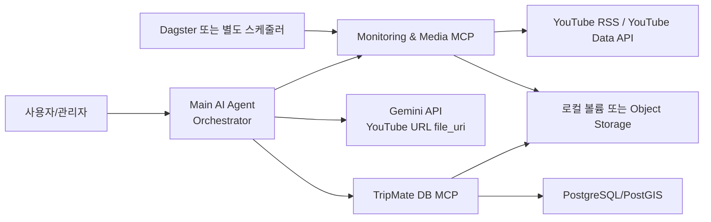

# YouTube 국내여행 정보 수집과 Gemini 분석 설계

## 상태

- 현재 문서는 설계 기준과 TODO다.
- `AGENTS.md` 기준에 따라 MCP 서버, Docker 컨테이너, DB migration, 코드 스캐폴딩은 아직 만들지 않는다.
- 구현 우선순위는 낮으며, 실제 구현 착수 전에는 이 문서를 바탕으로 저장 정책, 권한, 비용 정책을 한 번 더 확정한다.

## 목적

TripMate가 지정된 YouTube 채널, 플레이리스트, 영상 링크에서 국내여행 정보를 주기적으로 감지하고, Gemini API로 영상 내용을 요약해 장소 후보와 여행 팁을 자체 DB에 누적하는 구조를 설계한다.

목표는 다음과 같다.

- 사용자가 지정한 채널이나 플레이리스트의 신규 영상을 자동 감지한다.
- 사용자가 직접 전달한 YouTube 영상 링크도 같은 파이프라인으로 처리한다.
- 전체 동영상 파일을 저장하지 않고, Gemini API에 YouTube URL을 직접 전달해 분석한다.
- Gemini가 추출한 장소 후보, 영상 요약, 근거 timestamp, 대표 프레임 이미지를 TripMate DB에 누적한다.
- 장소 후보는 기존 `map_features`, `source_records`, `feature_mapping_candidates`, `media_asset` 구조와 연결할 수 있게 한다.
- 장기적으로는 `youtube_place_mcp`와 `address_code_lookup_mcp`를 별도 Docker 컨테이너의 MCP 서버로 구동한다.

## 공식 기능 확인

2026-04-29 확인 기준 Gemini API는 YouTube URL을 `file_data.file_uri`로 직접 전달하는 방식을 공식 문서에 제공한다. 다만 이 기능은 preview이며, 요금과 rate limit은 바뀔 수 있다. 또한 공개 영상만 처리할 수 있다.

Google 문서 기준으로 중요한 제약은 다음이다.

- YouTube URL 직접 전달은 preview 기능이다.
- 무료 tier에는 YouTube 영상 처리량 제한이 있다.
- Gemini 2.5 이전 모델은 요청당 영상 1개 제한이 있고, 2.5 이상은 요청당 최대 10개 영상까지 가능하다.
- private 또는 unlisted 영상은 처리할 수 없다.
- 기본 영상 처리는 1 FPS 샘플링이므로 빠르게 지나가는 간판, 메뉴판, 지도 정보는 놓칠 수 있다.
- 긴 영상 또는 반복 질의에는 context caching 검토가 필요하다.

따라서 “YouTube 링크를 Gemini에 직접 넘기는 방식”은 기본 아키텍처로 채택하되, 안정화된 영구 기능처럼 가정하지 않는다. 실패 시 전체 영상을 다운로드해 우회하는 로직은 기본값으로 두지 않고, metadata-only 실패 기록 또는 관리자 재처리 대상으로 남긴다.

참고:

- Gemini video understanding: `https://ai.google.dev/gemini-api/docs/video-understanding`
- YouTube Data API quota costs: `https://developers.google.com/youtube/v3/determine_quota_cost`

## 추천 아키텍처



### Main AI Agent

책임:

- 사용자가 직접 전달한 YouTube URL, playlist URL, channel ID, handle을 정규화한다.
- Monitoring & Media MCP에 신규 영상 조회 또는 수동 영상 등록을 요청한다.
- Gemini API에 YouTube URL과 구조화 prompt를 전달한다.
- Gemini 응답의 장소 후보, timestamp, 요약, 신뢰도, 근거를 검증 가능한 JSON으로 파싱한다.
- 필요한 timestamp의 대표 프레임 추출을 Monitoring & Media MCP에 요청한다.
- DB MCP를 통해 원천 영상, 분석 실행, 장소 후보, media asset을 upsert한다.

주의:

- Agent는 DB에 직접 접속하지 않는다.
- Agent는 YouTube 영상 파일을 직접 다운로드하지 않는다.
- Agent는 Gemini 응답을 곧바로 지도 노출 장소로 확정하지 않고, 기본적으로 `pending` 또는 `draft` 상태로 저장한다.

### Monitoring & Media MCP

책임:

- 지정된 channel ID의 RSS feed를 주기적으로 확인한다.
- playlist 또는 channel 전체 이력이 필요할 때만 YouTube Data API를 사용한다.
- 신규 video ID를 dedupe해 Agent에 반환한다.
- Agent가 요청한 timestamp의 프레임 이미지만 추출해 저장 위치를 반환한다.
- 전체 영상 파일은 장기 저장하지 않는다.

권장 입력:

| 입력 | 설명 |
| --- | --- |
| `source_type` | `channel`, `playlist`, `video` |
| `source_value` | channel ID, playlist ID, video URL 또는 video ID |
| `poll_interval_minutes` | source별 감시 주기 |
| `last_seen_video_published_at` | 마지막 확인 시각 |
| `max_items` | 한 번에 반환할 최대 신규 영상 수 |

권장 도구:

| tool | 설명 |
| --- | --- |
| `normalize_youtube_input` | URL, handle, channel ID, playlist ID, video ID를 정규화 |
| `upsert_monitor_source` | 감시 대상 등록 또는 갱신 |
| `poll_monitor_source` | 신규 영상 목록 반환 |
| `get_video_metadata` | 필요한 경우 `videos.list`로 상세 metadata 보강 |
| `extract_frame` | `video_id + timestamp` 기준 대표 프레임 추출 |
| `mark_video_processed` | 분석 완료 상태 기록 |

프레임 추출 기준:

- 원칙적으로 전체 영상을 장기 저장하지 않는다.
- timestamp별 대표 이미지 추출을 위해 일시적인 stream 접근이나 임시 파일이 필요할 수 있다. 이 임시 파일은 작업 완료 즉시 삭제한다.
- YouTube 기본 thumbnail로 충분한 경우에는 정확한 timestamp frame 대신 thumbnail을 우선 사용할 수 있다.
- 저장 이미지에는 `source_url`, `video_id`, `timestamp`, `extracted_at`, `license/status` metadata를 남긴다.
- 저작권/약관 검토가 끝나기 전에는 대표 프레임을 공개 UI 기본 이미지로 노출하지 않고 관리자 검수 또는 내부 후보 화면에서만 사용한다.

### TripMate DB MCP

책임:

- TripMate DB 조회와 입력을 담당하는 별도 MCP 서버다.
- read/write tool을 분리하고, write tool은 service 계층과 같은 검증 규칙을 적용한다.
- 장소 후보를 `map_features`에 바로 active로 넣지 않고, 원천 row와 후보 매핑 상태를 먼저 남긴다.
- 주소/좌표 매핑은 기존 주소 체계와 PostGIS 경계 규칙을 따른다.

권장 도구:

| tool | 설명 |
| --- | --- |
| `find_map_features` | 이름, 주소, 좌표 주변 기존 지도 객체 조회 |
| `upsert_source_record` | YouTube 영상/분석 원천 record 저장 |
| `upsert_feature_candidate` | 장소 후보 저장 또는 갱신 |
| `link_candidate_to_feature` | 검수 후 기존 `map_feature`에 연결 |
| `create_draft_map_feature` | 검수 대상 draft 지도 객체 생성 |
| `upsert_media_asset` | 대표 프레임 또는 thumbnail 저장 metadata 등록 |
| `link_media_to_feature_or_candidate` | media와 후보/지도 객체 연결 |

## YouTube 업데이트 감지 전략

### 채널 감시

권장 기본값은 RSS 우선이다.

- feed URL: `https://www.youtube.com/feeds/videos.xml?channel_id=<CHANNEL_ID>`
- 기본 주기: 1시간에서 6시간 사이. 초기 추천값은 2시간이다.
- RSS에서 새 video ID를 발견했을 때만 YouTube Data API `videos.list`로 상세 metadata를 보강한다.
- RSS가 실패하거나 channel ID를 모르는 경우에만 YouTube Data API를 보조로 사용한다.

이유:

- YouTube Data API는 기본 quota가 10,000 units/day다.
- 공식 quota 표 기준 `search.list`는 100 units, `videos.list`는 1 unit이다.
- 짧은 주기의 `search.list` polling은 피한다.
- 채널 handle이나 사용자 입력 URL을 channel ID로 해석하는 초기 1회 작업 외에는 search API를 쓰지 않는 것이 좋다.

### 플레이리스트 감시

playlist URL이 들어오면 `playlistItems.list` 또는 RSS/공개 feed 가능성을 먼저 검토한다.

- playlist는 channel RSS와 달리 완전한 신규 감지 기준이 애매할 수 있다.
- 사용자가 직접 playlist를 등록하면 최초 1회 전체 목록을 가져오고 이후에는 최신 N개만 비교한다.
- 대량 playlist는 한 번에 모두 Gemini 분석하지 않고 queue에 넣어 rate limit을 적용한다.

### 직접 영상 링크

직접 영상 URL은 polling 없이 즉시 분석 queue에 넣는다.

- 이미 처리한 `video_id`라면 기존 분석 결과를 반환하거나 재분석 옵션을 둔다.
- 같은 영상이라도 prompt version, model, 분석 목적이 다르면 별도 `analysis_run`으로 기록한다.

## Gemini 분석 전략

### 입력 방식

기본 입력은 YouTube URL 직접 전달이다.

```json
{
  "parts": [
    {
      "file_data": {
        "file_uri": "https://www.youtube.com/watch?v=<VIDEO_ID>"
      }
    },
    {
      "text": "국내여행 앱에 저장할 장소 후보를 JSON으로 추출..."
    }
  ]
}
```

프롬프트는 한국 국내여행 도메인에 맞춰 다음 정보를 구조화해 요청한다.

| 필드 | 설명 |
| --- | --- |
| `video_summary` | 영상 전체 요약 |
| `travel_theme` | 가족여행, 드라이브, 맛집, 숙박, 축제 등 |
| `places[]` | 장소 후보 목록 |
| `places[].name` | 장소명 또는 상호명 |
| `places[].kind_hint` | `place`, `event`, `route`, `area`, `notice` 후보 |
| `places[].category_hint` | TripMate category 또는 place_kind 힌트 |
| `places[].address_hint` | 영상에서 추론한 주소 문자열 |
| `places[].coordinate_hint` | 영상/설명란에서 명확히 주어진 좌표가 있을 때만 |
| `places[].evidence_summary` | 짧은 근거 요약. 자막/설명 원문 장문 저장 금지 |
| `places[].timestamps[]` | 장소가 등장하거나 언급되는 timestamp |
| `places[].representative_frame_timestamp` | 대표 프레임 후보 timestamp |
| `places[].confidence` | 0~1 신뢰도 |
| `warnings[]` | 불확실한 주소, 광고성 내용, 계절성, 폐업 가능성 등 |

### 모델과 비용 정책

권장 기본값:

- 1차 추출: 빠르고 저렴한 Gemini Flash 계열
- 낮은 신뢰도 후보 재검토: 더 강한 모델 또는 사람 검수
- 긴 영상 반복 분석: context caching 검토
- 같은 영상 재분석: `prompt_version + model + video_id + input_options`로 idempotency key 생성

주의:

- Gemini가 영상 URL을 처리하더라도 token 비용은 영상 길이에 영향을 받는다.
- 기본 1 FPS 샘플링 때문에 간판과 메뉴판처럼 짧게 지나가는 텍스트는 누락될 수 있다.
- 장소명/주소/좌표는 Gemini 결과만 믿지 않고 DB MCP에서 기존 주소 DB와 기존 `map_features`로 검증한다.

## DB 누적 설계

현재 TripMate의 최종 지도 객체 기준은 `map_features`와 타입별 detail table이다. YouTube는 공공데이터처럼 권위 원천이 아니므로, 바로 `active` 지도 객체로 확정하지 않는 것이 안전하다.

추천 저장 흐름:

1. `source_records`에 영상 원천 record 저장
2. 별도 YouTube 분석 실행 테이블 또는 `source_records.extra`에 분석 실행 metadata 저장
3. 장소 후보는 `feature_mapping_candidates` 또는 후속 `youtube_place_candidates`에 `pending`으로 저장
4. 기존 지도 객체와 confidence가 충분히 높으면 연결 후보를 만든다.
5. 사람이 승인하거나 자동 승인 기준을 통과하면 `map_features` draft 또는 active로 승격한다.
6. 대표 프레임은 `media_asset`에 저장하고, 승인된 feature는 `map_feature_media`로 연결한다.

### 권장 신규 테이블 후보

실제 구현 시 migration으로 추가할 후보이며, 지금은 설계안이다.

#### `youtube_monitor_sources`

| 컬럼 | 설명 |
| --- | --- |
| `id` | 내부 ID |
| `source_type` | `channel`, `playlist` |
| `source_value` | channel ID 또는 playlist ID |
| `display_name` | 화면 표시명 |
| `poll_interval_minutes` | 감시 주기 |
| `is_enabled` | 활성 여부 |
| `last_checked_at` | 최근 확인 시각 |
| `last_seen_video_id` | 마지막 감지 영상 |
| `last_seen_published_at` | 마지막 감지 영상 발행시각 |
| `created_by_user_id` | 등록 사용자 |
| `extra` | handle, RSS URL, API metadata |

#### `youtube_video_records`

| 컬럼 | 설명 |
| --- | --- |
| `id` | 내부 ID |
| `video_id` | YouTube video ID unique |
| `video_url` | canonical watch URL |
| `channel_id` | channel ID |
| `channel_title` | 채널명 |
| `title` | 영상 제목 |
| `description_summary` | 설명란 요약. 원문 장기 저장 금지 |
| `published_at` | 영상 공개 시각 |
| `duration_seconds` | 가능하면 `videos.list`에서 보강 |
| `thumbnail_url` | YouTube 제공 thumbnail URL |
| `source_record_id` | `source_records` 연결 |
| `first_seen_at`, `last_checked_at` | 수집 시각 |

#### `youtube_analysis_runs`

| 컬럼 | 설명 |
| --- | --- |
| `id` | 실행 ID |
| `video_record_id` | 영상 FK |
| `provider` | `gemini` |
| `model` | 사용 모델 |
| `prompt_version` | prompt 버전 |
| `idempotency_key` | 중복 방지 key |
| `status` | `queued`, `running`, `succeeded`, `failed`, `skipped` |
| `result_summary` | 분석 요약 |
| `result_json` | 구조화 결과 |
| `error_code`, `error_message` | 실패 정보 |
| `started_at`, `finished_at` | KST timestamp |

#### `youtube_place_candidates`

| 컬럼 | 설명 |
| --- | --- |
| `id` | 후보 ID |
| `analysis_run_id` | 분석 실행 FK |
| `source_record_id` | source record FK |
| `candidate_name` | Gemini가 추출한 장소명 |
| `candidate_kind` | `place`, `event`, `route`, `area`, `notice` 후보 |
| `address_hint` | 주소 힌트 |
| `longitude`, `latitude`, `geom` | 명확한 좌표가 있을 때만 |
| `legal_dong_code` | 좌표 또는 주소로 검증된 경우 |
| `evidence_summary` | 짧은 근거 요약 |
| `timestamps` | JSONB 배열 |
| `representative_frame_media_id` | 대표 프레임 media |
| `matched_feature_id` | 기존 지도 객체 후보 |
| `decision` | `pending`, `auto_approved`, `approved`, `rejected` |
| `confidence_score` | 0~100 |
| `extra` | 원천별 보조 정보 |

### `source_name` 확장 필요

현재 map feature 설계의 `source_name` enum에는 `youtube`와 `gemini`가 없다. 구현 시 다음 중 하나를 결정해야 한다.

추천:

- 원천 매체 provider: `youtube`
- 분석 생성 provider: `gemini`
- `source_records.source_name = youtube`
- `youtube_analysis_runs.provider = gemini`

이렇게 두면 “영상 원천”과 “AI 추출 실행”이 분리되어 나중에 같은 영상을 다른 모델로 재분석해도 lineage가 선명하다.

## 주소와 장소 매핑 기준

YouTube 영상은 주소 원천으로 신뢰도가 낮다. 따라서 매핑 우선순위는 다음으로 둔다.

1. 영상 설명란이나 공식 링크에 명확한 주소가 있고 Juso exact match가 되는 경우
2. 영상 또는 설명란에 명확한 좌표가 있는 경우 PostGIS point-in-polygon으로 법정동 매핑
3. 기존 `map_features`와 이름, 주소, 좌표가 높은 신뢰도로 일치하는 경우 연결 후보 생성
4. 주소/좌표가 없고 이름만 있는 경우 `pending` 후보로 저장하고 검색 노출 금지

금지:

- Gemini가 추론한 주소를 확정 주소처럼 저장하지 않는다.
- 주소 문자열 fuzzy matching만으로 `legal_dong_code`, `road_name_code`, `road_address_management_no`를 확정하지 않는다.
- 영상 속 간판만 보고 사업자번호나 전화번호를 추정하지 않는다.

## 저장 정책

저장 가능:

- YouTube video ID, canonical URL, 제목, 채널명, 공개시각
- 영상 설명란의 짧은 요약
- Gemini가 생성한 영상 요약과 장소 후보 요약
- 장소 후보명, 주소 힌트, 좌표 힌트, timestamp, confidence
- 대표 프레임 이미지 파일 경로 또는 object storage key
- 원천 URL, frame timestamp, 추출 시각, 처리 상태

기본 저장 금지:

- 전체 영상 파일
- 전체 자막 전문
- 전체 설명란 전문
- 댓글 전문
- YouTube API key, Gemini API key 원문

검토 필요:

- 대표 프레임 이미지를 공개 UI에 노출할 수 있는지
- YouTube thumbnail URL을 직접 hotlink할지, 자체 저장할지
- 영상 설명란의 외부 링크를 어느 범위까지 저장할지
- 댓글을 수집할지. 현재 추천 기본값은 댓글 미수집이다.

## 실패 처리

| 상황 | 처리 |
| --- | --- |
| Gemini가 YouTube URL 처리 실패 | `youtube_analysis_runs.status='failed'` 기록, metadata-only 상태로 보존 |
| 영상이 private/unlisted/deleted | skip하고 재시도하지 않음. 공개 상태 변경 가능성이 있으면 다음 주기에서 metadata만 확인 |
| RSS feed 실패 | backoff 후 재시도, 연속 실패 시 관리자 알림 후보 |
| YouTube Data API quota 부족 | 해당 source poll 지연, `search.list` 사용 금지 유지 |
| Gemini 결과 JSON 파싱 실패 | raw 전체 저장 없이 에러와 짧은 응답 앞부분만 redacted log에 저장 |
| 장소 후보가 전부 낮은 신뢰도 | `pending` 저장 또는 저장 생략. 지도 노출 금지 |
| 프레임 추출 실패 | 장소 후보는 저장하되 media 상태를 `failed`로 기록 |

## 권장 스케줄

초기 기본값:

| 작업 | 주기 |
| --- | --- |
| channel RSS poll | 2시간 |
| playlist poll | 6시간 또는 수동 |
| 직접 영상 링크 분석 | 즉시 queue |
| Gemini 분석 worker | 동시성 1~2개부터 시작 |
| frame extraction | 분석 성공 후 후보당 최대 1장, 영상당 최대 10장 |
| failed retry | 15분 간격 2회, 이후 관리자 검토 |

쿼터 보호:

- `search.list`는 channel/playlist/video ID 해석 실패 시에만 예외적으로 사용한다.
- `videos.list`는 신규 video ID를 최대 50개 단위로 묶어 호출한다.
- 이미 처리한 영상은 `video_id + prompt_version + model` 기준으로 재분석을 막는다.
- Gemini 분석은 source별 일일 최대 처리량을 둔다.

## 보안과 권한

Gemini API key 정책은 두 가지 모드가 가능하다.

1. 시스템/관리자 키 모드
   - 배치 모니터링과 자동 분석에 적합하다.
   - 비용과 quota를 운영자가 통제한다.
   - 추천 기본값이다.

2. 사용자 개인 키 모드
   - 사용자가 직접 영상 링크를 넣고 개인 비용으로 분석할 때 적합하다.
   - 기존 `docs/integrations/gemini.md`의 사용자 키 모델을 따른다.

추천:

- 자동 모니터링은 시스템/관리자 Gemini key 사용
- 사용자 수동 분석은 사용자 개인 key 또는 시스템 key 중 정책 선택
- key 원문은 DB/로그/MCP 응답에 저장하지 않음
- MCP write tool은 관리자 또는 명시적 권한이 있는 worker identity만 사용

## 의사결정 필요

1. 자동 YouTube 모니터링에 시스템 Gemini key를 쓸지, 사용자 개인 key만 허용할지.
   - 추천: 자동 모니터링은 시스템/관리자 key.

2. Gemini 추출 장소를 `map_features` draft로 바로 만들지, 별도 `youtube_place_candidates`에 먼저 둘지.
   - 추천: 별도 후보 테이블 후 검수/승격.

3. 대표 프레임 이미지를 공개 UI에 노출할지.
   - 추천: 초기에는 관리자/검수 화면에서만 사용.

4. 댓글을 분석 범위에 넣을지.
   - 추천: 초기에는 댓글 미수집.

5. YouTube Data API를 어느 범위까지 사용할지.
   - 추천: RSS 우선, `videos.list` 보강, `search.list`는 예외.

6. playlist 최초 등록 시 전체 backlog를 모두 분석할지.
   - 추천: 최근 N개 또는 사용자가 선택한 영상만 분석.

7. 장소 후보 자동 승인 기준을 둘지.
   - 추천: 초기에는 자동 승인 없음. 운영 데이터가 쌓이면 confidence, 주소 exact match, 기존 feature match 기준으로 재검토.

## 구현 TODO

- MCP 서버 런타임 선택: Python MCP SDK 또는 Node MCP server.
- 별도 Docker 컨테이너 구성 기준 작성.
- `youtube_monitor_sources`, `youtube_video_records`, `youtube_analysis_runs`, `youtube_place_candidates` migration 설계.
- `source_name` enum에 `youtube` 추가 여부 결정.
- `youtube_place_mcp` tool contract 작성.
- `tripmate_db_mcp` read/write tool contract 작성.
- Gemini prompt version과 JSON schema 작성.
- 대표 프레임 저장소 선택: 로컬 볼륨, S3 호환 object storage, 또는 DB 외부 static storage.
- 관리자 검수 UI 설계.
- YouTube/Gemini API key secret 관리 방식 결정.
- YouTube API와 Gemini API quota 모니터링 및 비용 대시보드 설계.
